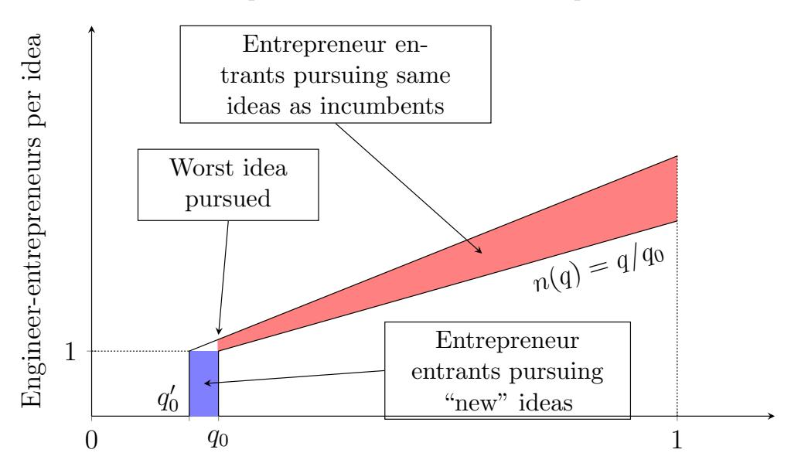
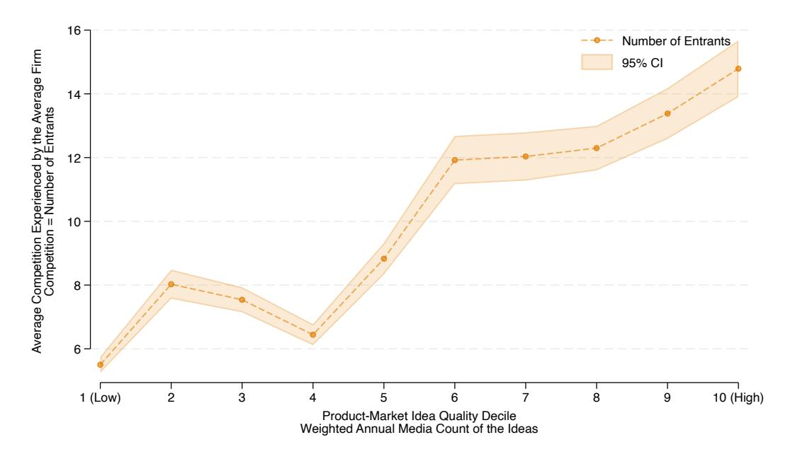
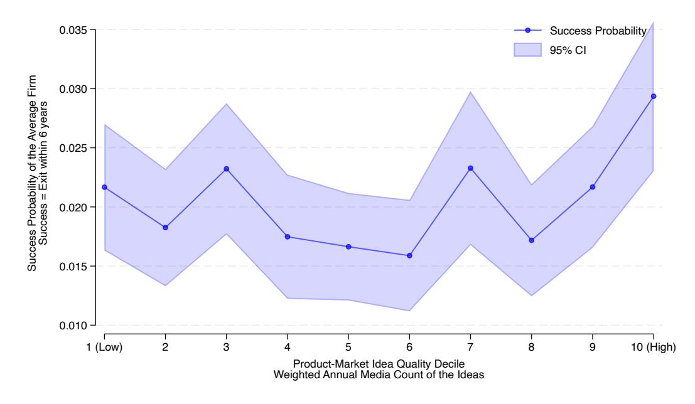

# Price Theory of Silicon Valley<sup>*</sup>

John Horton Amir Sariri

February 25, 2026

#### Abstract

We develop a general equilibrium model of technology entrepreneurship in which engineers choose between founding startups and employment, startups require venture capital, and entrepreneurs pursuing the same idea compete in winner-take-all product markets. Because opportunities depend on publicly observable advances, many entrepreneurs target the same ideas simultaneously, and better ideas attract proportionally more entrants until per-firm success probabilities equalize. This equalization generates a congestion externality governed by a single sufficient statistic, the elasticity of success with respect to entry. When startups face idiosyncratic execution risk, excess entry concentrates on the highest-quality ideas, creating a "best-idea trap" in which the most promising opportunities yield the smallest marginal gain per additional founder. We test these predictions on 37,818 US technology startups founded between 2012 and 2018, using a new LLM-based method that assigns each startup to one of 2,045 product-market niches. Congestion elasticities in competitive niches with at least one successful exit range as high as -0.86, indicating high levels of crowding in the US startup ecosystem. Idea-level success is concave in entry, consistent with the model's diminishingreturns prediction. The results provide a distinct market-failure justification for public R&D as a mechanism that reduces crowding existing opportunities to exploring new ones.

Keywords: entrepreneurship, startups, congestion externality, venture capital, LLMs JEL Classifications: M13, L26, L22, D62, O31

<sup>*</sup>Thanks to Aaron Chatterji, Ajay Agrawal, Andrey Fradkin, Ashish Arora, Ben Golub, Bill Kerr, Bo Cowgill, Boyan Jovanovic, Chuck Eesley, Deepak Hegde, FM Scherer, Glen Weyl, Hal Varian, Hanna Halaburda, Ian Cockburn, Luke Stein, Matt Backus, Megan MacGarvie, Petra Moser, Ramesh Johari, Roy Radner, Shane Greenstein, Steve Tadelis, Tal Gross, Tom  Astebro, and Joe Golden for helpful comments, suggestions, and discussions. Thanks to participants at the NBER productivity seminar, the Duke Strategy Conference and the Creativity and Innovation Research Initiative seminar. We are grateful to ExpectedParrot staff for providing technical support for our LLM method implementation. Thanks to Jayson Roxas for excellent research assistance and to Michelle Lindner for superb help in preparing the manuscript.

<sup></sup>MIT & NBER

<sup></sup>Purdue University

# 1 Introduction

When Airbnb applied to venture capital firms for seed funding, most found the idea of strangers sleeping in each other's apartments implausible. Fred Wilson of Union Square Ventures, one of the most respected VCs in New York, rejected investing in Airbnb, despite insistence from Paul Graham, the equally respected YCombinator founder who had backed the company. By Airbnb's IPO in December 2020, a half a million dollar seed investment in the company was estimated to be worth roughly \$4.8 billion.[1](#page-1-0) Now consider ride-hailing. The idea of booking a ride from a phone was so immediately legible to investors and entrepreneurs that it attracted dozens of well-funded competitors around the world, most of which failed.[2](#page-1-1)

These examples illustrate a general feature of technology entrepreneurship. Because business opportunities depend on widely observable technological advances, many entrepreneurs recognize the same opportunities at the same time. Collections of startups pursuing more or less the same idea are common, and experienced founders surely consider the competition they will face. That is, idea selection does not happen in isolation, entrepreneurs must also secure venture capital and compete for skilled employees, so the cost of capital and the price of talent interact with the entry decision. What determines how much entrepreneurial entry a given opportunity attracts, and what are the consequences of this entry for the startups involved?

This paper shows that free entry into technology entrepreneurship generates a congestion externality whose severity is governed by a single sufficient statistic, the elasticity of startup success probability with respect to the number of entrants, and provides the first empirical estimate of this object. We develop a general equilibrium model in which engineers choose between founding a startup and working as employees, startups require venture capital, and entrepreneurs pursuing the same business idea compete in winner-take-all product markets. Better ideas attract proportionally more entrants until per-firm success probabilities equalize across all pursued ideas. This equalization creates a business-stealing externality that individual entrepreneurs do not internalize when deciding to enter. We complement the theory with descriptive empirics on 37,818 US technology startups, using a new LLM-based measurement approach that assigns startups to 2,045 product-market niches and tracks entry and exit patterns across the idea quality distribution.

The theory builds on two lines of work. Occupational choice models in the tradition

<span id="page-1-0"></span><sup>1</sup>See the original email exchange at <https://paulgraham.com/airbnb.html> and Sequoia Capital's blog at <https://bit.ly/4aWMZSv>.

<span id="page-1-1"></span><sup>2</sup>Sidecar and Hailo, which raised \$35 million and \$100 million respectively, shut down in 2015 and 2016. Gett spent \$200 million to acquire Juno in 2017 and closed the service two years later. See [https://bit.](https://bit.ly/3OldLv6) [ly/3OldLv6](https://bit.ly/3OldLv6), <https://bit.ly/4tDKxrz>, and <https://bit.ly/4qIYYrG>.

of [Kihlstrom & Laffont](#page-27-0) [\(1979\)](#page-27-0), [Lucas](#page-27-1) [\(1978\)](#page-27-1), and [Lazear](#page-27-2) [\(2004\)](#page-27-2) ask who becomes an entrepreneur but treat the opportunity as given and focus on the margin between employment and self-employment. Free-entry models following [Mankiw & Whinston](#page-27-3) [\(1986\)](#page-27-3) show that entry can be socially excessive when entrants steal business from incumbents, and Schumpeterian growth models feature similar dynamics on product lines [\(Aghion & Howitt,](#page-26-0) [1992;](#page-26-0) [Klette & Kortum,](#page-27-4) [2004\)](#page-27-4), but firms in those models arrive on product lines by chance rather than choosing among visible opportunities. Our model combines the occupational choice margin with endogenous idea selection, and the interaction between these two margins generates the congestion externality that neither tradition captures alone. Recent experimental evidence from [Bryan](#page-26-1) et al. [\(Forthcoming\)](#page-26-1) reinforces the mechanism, showing that workers in startup labor markets respond strongly to common quality signals and exhibit overoptimistic beliefs about startup success.

The model yields three main results. First, the decentralized equilibrium generates excessive entry relative to the social optimum whenever this elasticity is negative. Excess entry occurs because entrepreneurs capture their full private expected return but ignore the crowding externality they impose on others pursuing the same idea. Second, when startups face idiosyncratic execution risk that justifies multiple attempts per idea, the excess entry concentrates disproportionately on the highest-quality ideas. The socially optimal allocation, by contrast, is concave in idea quality, spreading more effort toward marginal ideas. The divergence between decentralized and optimal allocations is steepest at the top of the quality distribution, creating what we call a "best-idea trap." Third, we show that engineer wages are a sufficient statistic for total system output, providing a directly observable metric for evaluating the health of an entrepreneurial ecosystem without requiring knowledge of the underlying idea distribution.

The descriptive empirics speak to the entry and congestion predictions. Higher perceived idea quality, measured by media attention, is associated with greater entry, yet perfirm success probabilities are statistically indistinguishable from flat across the quality distribution. The estimated elasticity of success with respect to entry is -0.86, placing the US startup ecosystem closer to the complete-crowding benchmark (eta = -1) than to the novel-idea benchmark (eta = 0). We also find that at the idea level, the probability that a niche produces at least one successful exit is concave in entry, consistent with the diminishing returns that drive the excess-entry result.

A central challenge for testing congestion in entrepreneurship has been the absence of product-market niche definitions at the startup level. Published methods for measuring competitive proximity rely on SEC filings such as 10-K product descriptions available only for public firms [\(Hoberg & Phillips,](#page-26-2) [2010\)](#page-26-2). Building on recent advances in the use of LLMs in social science research [Manning](#page-27-5) et al. [\(2024\)](#page-27-5), we address this gap with a new LLM-based approach that infers the competitive neighborhood of each startup from its brief business description. The method asks an LLM agent, embedded in the role of a Google AdWords specialist, to generate the set of customer search intents each firm would pay to reach, then clusters firms by the overlap in these keyword portfolios. This approach enables the first measurement of the congestion elasticity eta at the product-market niche level across the population of US technology startups, placing the ecosystem on the [-1, 0] continuum that the theory identifies.

For policy, the model offers a market-failure justification for public R&D that is distinct from standard knowledge-spillover arguments. Expanding the supply of economically distinct ideas directly reduces congestion by shifting entry from the intensive margin to the extensive margin. For entrepreneurs and investors, entry density is a first-order determinant of risk, since the most popular ideas in a vintage may systematically underperform because they attract the most competition.

The remainder of the paper proceeds as follows. [Section 2](#page-3-0) reviews related work. [Sec](#page-4-0)[tion 3](#page-4-0) presents the model. [Section 4](#page-7-0) derives the equilibrium and the congestion elasticity eta. [Section 5](#page-10-0) shows that the decentralized allocation features excess entry concentrated on the best ideas. [Section 6](#page-12-0) introduces the LLM-based measurement of product-market niches. [Section 7](#page-18-0) estimates eta and tests the concavity prediction, and [Section 8](#page-24-0) concludes.

# <span id="page-3-0"></span>2 Related Work

Venture-backed, growth-oriented entrepreneurship is a small fraction of all entrepreneurship [\( Astebro](#page-28-0) et al., [2014\)](#page-28-0), and much of what we know about the conventional variety does not apply to it. Conventional entrepreneurs enter established markets, often self-financed, with entry positively correlated with wealth [\(Evans & Jovanovic,](#page-26-3) [1989;](#page-26-3) [Blanchflower & Oswald,](#page-26-4) [1998;](#page-26-4) [Holtz-Eakin](#page-27-6) et al., [1994\)](#page-27-6) and downside risk managed through firm size, capital structure, and the option to default [\(Herranz](#page-26-5) et al., [2013\)](#page-26-5).[3](#page-3-1) Innovative entrepreneurship looks different. Founders confront extreme payoff skewness and depend on specialized equity finance [\(Lerner & Nanda,](#page-27-7) [2020\)](#page-27-7). VC syndication and staged finance decouple entry from founder wealth and make competitive dynamics among simultaneously entering startups central to returns.

Our model's closest theoretical antecedent is the free-entry framework of [Mankiw &](#page-27-3) [Whinston](#page-27-3) [\(1986\)](#page-27-3), where entry is socially excessive because entrants steal business from incumbents. In our setting, the "business" being stolen is the probability of being the winning

<span id="page-3-1"></span><sup>3</sup>[Hurst & Lusardi](#page-27-8) [\(2004\)](#page-27-8) question the liquidity-constraint interpretation of the wealth-entry correlation.

startup in a product market. Schumpeterian growth models formalize similar businessstealing externalities in the context of innovation [\(Aghion & Howitt,](#page-26-0) [1992;](#page-26-0) [Akcigit & Kerr,](#page-26-6) [2010;](#page-26-6) [Acemoglu](#page-26-7) et al., [2013\)](#page-26-7), and multi-product firm models feature entry on specific product lines [\(Klette & Kortum,](#page-27-4) [2004\)](#page-27-4). In those models, however, firms arrive on product lines by chance rather than choosing among visible opportunities. Our model endogenizes this choice, so the concentration of entry on high-quality ideas is itself an equilibrium outcome. Recent experimental evidence from [Bryan](#page-26-1) et al. [\(Forthcoming\)](#page-26-1) supports the behavioral premise, showing that workers in startup labor markets respond strongly to common quality signals and hold overoptimistic beliefs about startup success.

A growing literature studies how entrepreneurs resolve uncertainty through costly experimentation [\(Agrawal](#page-26-8) et al., [2021,](#page-26-8) [2026\)](#page-26-9) and how external advisors shape the learning process. [Sariri](#page-28-1) [\(2025\)](#page-28-1) shows that mentoring by VCs and angel investors improves startup market performance, with the defining element of effective advice being to help founders do less and learn more about the opportunity itself. These studies focus on within-idea uncertainty about how to execute, whereas our model focuses on across-idea uncertainty about where to enter.

Furthermore, entrepreneurial strategy research emphasizes multiple commercialization paths and commitment under uncertainty (Gans [et al.](#page-26-10), [2019\)](#page-26-10), complemented by the entrepreneurial finance work examining how experimentation and capital availability determine the ideas that get pursued [\(Ewens](#page-26-11) et al., [2018;](#page-26-11) [Lerner & Nanda,](#page-27-7) [2020;](#page-27-7) [Howell,](#page-27-9) [2020\)](#page-27-9). We extend these studies by recognizing the congestion externality that arises when multiple entrepreneurs pursue the same opportunity.

# <span id="page-4-0"></span>3 Model Setup

## 3.1 Economic Environment

Most occupational models of entrepreneurship posit some individual characteristic that determines selection, whether managerial skill [\(Lucas,](#page-27-1) [1978\)](#page-27-1), balanced skills [\(Lazear,](#page-27-2) [2004\)](#page-27-2), risk tolerance [\(Kihlstrom & Laffont,](#page-27-0) [1979\)](#page-27-0), or opportunity spotting [\(Holmes & Schmitz Jr,](#page-26-12) [1990\)](#page-26-12).[4](#page-4-1) For innovative entrepreneurship, these characteristics matter less. Risk aversion is central in Kihlstrom and Laffont, but VC financing removes most individual downside risk and leaves only the opportunity cost of time. Managerial ability determines selection in

<span id="page-4-1"></span><sup>4</sup>These models share a Knightian and Roylian logic [\(Knight,](#page-27-10) [1921;](#page-27-10) [Roy,](#page-28-2) [1951\)](#page-28-2) in which financial returns, mediated by individual characteristics, drive the occupational margin. [Gromb & Scharfstein](#page-26-13) [\(2002\)](#page-26-13) also model entrepreneurs who differ in ability, focusing on the relative returns to internal versus external innovation.

Lucas, but technology founders must first be technically excellent, and successful startups bring in professional management as they scale.[5](#page-5-0) We therefore treat founders as ex ante symmetric and focus on how their entry decisions interact in equilibrium.

The model captures an entrepreneurial cluster as three interconnected markets: the market for venture capital, the labor market for high-skilled individuals ("engineers"), and the product markets that successful startups serve. There is a mass S of engineers who must choose between founding a startup as an entrepreneur or joining an established startup as an employee. This occupational choice determines both the supply of entrepreneurial ventures and the availability of skilled labor needed to scale successful firms.

A startup is founded by a single engineer implementing a single business idea. Ideas differ in their probability of product market success, q  [0, 1], distributed with pdf f(.) over a mass kappa of potential ideas. These success probabilities are common knowledge, capturing the notion that certain technological or market opportunities are more promising than others. Technology entrepreneurs are typically exploiting recent, publicly observable advances; the startup's product depends critically on such an advance, and if it did not, the product would not be newly possible. This logic parallels the evidence on simultaneous discovery in science [\(Merton,](#page-27-11) [1957;](#page-27-11) [Lemley,](#page-27-12) [2011\)](#page-27-12) and implies that many entrepreneurs recognize the same opportunities at the same time, making common signals the natural driver of correlated entry.

Any entrepreneur is free to pursue any idea, but multiple entrepreneurs pursuing the same idea must compete in a winner-take-all product market where at most one startup succeeds, and then only if the underlying idea proves viable. Successful startups generate revenue R through a production function phi(l)R, where l represents the number of engineers hired as employees and phi : [0, S] -> [0, 1) is increasing and concave with phi ' (l) > 0 and phi ''(l) < 0. The assumption that liml-><sup>S</sup> phi(l) = 1 ensures that when nearly all engineers work as employees, the marginal return to entrepreneurship exceeds that of employment, guaranteeing an interior equilibrium. The model is static, so entry decisions are simultaneous, idea quality is common knowledge, and there is no learning or staged experimentation.

# 3.2 Entrepreneurial Entry

When n entrepreneurs pursue an idea with success probability q, each faces an individual success probability of q/n. This winner-take-all structure reflects the reality of technology markets dominated by network effects, patent races, or first-mover advantages. This assump-

<span id="page-5-0"></span><sup>5</sup>As [Lazear](#page-27-2) [\(2004\)](#page-27-2) writes, conventional innovation "may be as seemingly minor as recognizing that a particular street corner would be a good location for a dry cleaner." Technology entrepreneurs create entirely new products, making idea selection central rather than individual characteristics.

tion is testable. In [Table 4,](#page-24-1) we show that the data reject the strict single-winner prediction but are consistent with a small number of winners per idea, and the qualitative congestion and concavity predictions survive under this generalization. Entrepreneurs distribute themselves across ideas until success probabilities equalize at some threshold q0. An idea of quality q thus attracts q/q<sup>0</sup> entrepreneurs, with q<sup>0</sup> representing both the equilibrium success probability and the quality of the marginal idea pursued.

For a given threshold q0, the total number of funded entrepreneurs is:

$$E = \kappa \int_{q_0}^{1} \frac{q}{q_0} f(q) dq \tag{1}$$

The equilibrium value of q<sup>0</sup> emerges endogenously as engineers optimize their occupational choice, balancing the returns from entrepreneurship against wage employment. This equalization of success probabilities across pursued ideas captures a key insight. In particular, while better ideas are inherently more attractive, they draw proportionally more entrants until individual returns equalize. The marginal idea with quality q<sup>0</sup> attracts exactly one entrepreneur, making it the natural boundary between pursued and unpursued opportunities.

# 3.3 Labor Market and Venture Capital

Entrepreneurs require seed capital c to start their ventures, obtaining this funding from venture capitalists in exchange for equity. In equilibrium, VCs earn a required return r on their investment, implying that the entrepreneur's retained equity share e satisfies:

$$(1+r)c = (1-e)q_0\pi (2)$$

where pi represents the profits of a successful startup. These profits equal revenue minus labor costs: pi = phi(l * )R - wl<sup>*</sup> , where l * is the profit-maximizing number of employees and w is the equilibrium wage (see Appendix [B.2](#page-35-0) for proof that profits are always positive.).

The occupational indifference condition requires that expected returns from entrepreneurship equal the wage from employment:

$$w = eq_0\pi = q_0\pi - C \tag{3}$$

where C = (1 + r)c represents the total cost of founding a startup, including the opportunity cost of capital. This condition, combined with labor market clearing where (1 - g)S engineers work as employees for q0E successful startups determines the equilibrium fraction of entrepreneurs:

$$g = \frac{1}{1 + q_0 l^*} \tag{4}$$

The model thus endogenously determines wages, equity splits, and the allocation of en-

gineers between occupations. Higher startup costs C reduce entrepreneurial returns, shifting engineers toward employment. Conversely, greater product market opportunities R increase both wages and entrepreneurial equity, with the net effect on occupational choice depending on the elasticity of labor demand.

# <span id="page-7-0"></span>4 Equilibrium Characteristics

The model's equilibrium requires that engineers be indifferent between occupations, that VCs earn their required return, and that all markets clear. The returns to each occupation depend on the fraction choosing entrepreneurship: as g increases, more startups compete for ideas (lowering q0) while fewer engineers supply labor (raising w). These opposing forces ensure a unique crossing point.

Proposition 1 With a sufficiently small ratio of startup costs to potential revenue, C/R, a unique equilibrium exists.

The proof establishes that as g -> 0, the returns to entrepreneurship exceed those from employment since there is minimal idea competition and q<sup>0</sup> approaches the quality of the best available idea. Conversely, as g -> 1, employment dominates since excessive competition drives success probabilities toward zero while labor scarcity pushes wages arbitrarily high. The monotonicity of returns in g ensures these curves cross exactly once in the unit interval, pinning down the unique equilibrium allocation.

# 4.1 The Elasticity of Startup Success

A critical parameter governing the model's behavior is the elasticity of startup success probability with respect to the number of entrepreneurs. To derive this elasticity, consider how q<sup>0</sup> adjusts when the number of entrepreneurs increases by dE > 0. Some of these new entrepreneurs pursue ideas that were already being pursued by incumbents, while others pursue "new" ideas with quality q < q<sup>0</sup> that were previously below the viability threshold.

When dE entrepreneurs enter, ideas that were already pursued (those with q > q0) each receive q/q<sup>2</sup> 0 .dq<sup>0</sup> additional entrepreneurs, as the threshold q<sup>0</sup> falls by dq0. The total increase in entrepreneurs on existing ideas is thus kappa R 1 q0 (q/q<sup>2</sup> 0 )dq<sup>0</sup> . f(q)dq = E/q<sup>0</sup> . dq0. Additionally, a mass kappaf(q0)dq<sup>0</sup> of entrepreneurs pursue previously unpursued ideas in the interval [q<sup>0</sup> - dq0, q0]. Therefore:

$$dE = \kappa f(q_0)dq_0 + \frac{E}{q_0}dq_0 \tag{5}$$

After rearranging, we obtain the elasticity of startup success probability with respect to entrepreneurs:

<span id="page-8-0"></span>
$$\eta_E^{q_0} = -\frac{1}{1 + \kappa f(q_0)q_0/E} \tag{6}$$

This elasticity captures the extent of idea competition. When eta q0 <sup>E</sup> = -1 (which occurs when kappaf(q0) -> 0), there are no unpursued ideas at the frontier, and additional entrepreneurs merely crowd existing ideas without exploring new opportunities. Entrepreneurship becomes a zero-sum game. Conversely, when eta q0 <sup>E</sup> = 0 (which occurs when kappaf(q0) -> inf), each marginal entrepreneur pursues a previously unexplored idea, eliminating business-stealing effects.

The parameter kappaf(q0) represents the density of ideas at the margin. Industries with high startup costs naturally have fewer entrepreneurs and thus more unexplored ideas at the margin, leading to less elastic success probabilities. In contrast, sectors with low entry barriers (e.g., software) exhibit highly elastic success probabilities as entrepreneurs crowd the limited set of obviously viable opportunities.

## 4.2 Allocation of Entrepreneurs Across Ideas

[Figure 1](#page-9-0) illustrates how entrepreneurs distribute across ideas of varying quality. The upwardsloping line n(q) = q/q<sup>0</sup> shows the number of entrepreneurs per idea in equilibrium, where higher-quality ideas attract proportionally more entrants. The marginal idea at q<sup>0</sup> attracts exactly one entrepreneur, while an idea with success probability q = 0.8 would attract 0.8/q<sup>0</sup> entrepreneurs if, for instance, q<sup>0</sup> = 0.2 (implying four entrepreneurs on that idea).

Following an increase dE in the number of entrepreneurs, two effects occur. First, existing ideas attract additional entrants with each idea of quality q receiving q/q<sup>2</sup> 0 . dq<sup>0</sup> more entrepreneurs as competition intensifies. Second, previously unpursued ideas below the original threshold become viable as q<sup>0</sup> shifts leftward by dq0. The shaded regions in [Figure 1](#page-9-0) decompose these two effects. The area above the original allocation line represents crowding on existing ideas, while the area to the left of the original q<sup>0</sup> represents entry on newly viable ideas.

The relative importance of these margins determines the elasticity eta q0 E and thus the efficiency properties of the equilibrium. When most new entrepreneurs pursue previously unexplored ideas (the extensive margin dominates), the system efficiently expands the range of experimentation. When they primarily crowd existing opportunities (the intensive margin dominates), entry becomes socially wasteful as entrepreneurs merely redistribute rather than create success probabilities. Formally, |eta q0 E | equals the share of marginal entry absorbed by the intensive margin.

<span id="page-9-0"></span>Figure 1: The allocation of entrepreneurs over business ideas of varying quality, before and after a positive shock of dE new entrepreneurs



Startup idea ex ante success probability

Notes: This figure illustrates the number of entrepreneurs per idea before and after an increase of dE new entrepreneurs. Pre-shock, each idea with quality greater than q<sup>0</sup> received q/q<sup>0</sup> entrants, where q<sup>0</sup> was the worst idea still funded. After entry of additional entrepreneurs, there are both (1) more entrepreneurs per idea and (2) more entrepreneurs pursuing previously un-pursued ideas, pushing down q0.

## 4.3 Engineer Wages as a Sufficient Statistic for Output

The entrepreneurial system has q0E successful startups, each generating revenue Rphi(l * ). The social cost of generating this revenue is the total startup cost, EC. The net output of the system, total revenue minus total founding costs, equals the total number of engineers times the market wage:

$$Sw = q_0 ER\phi(l^*) - EC. (7)$$

<span id="page-10-2"></span>Proposition 2 The net social benefit of the entrepreneurial system is Sw.

Proof. See Appendix [B.10.](#page-38-0)

The proof follows from the occupational indifference condition and market clearing. Because every engineer earns w regardless of occupation, and because VC returns are pinned at r, the wage absorbs all variation in the system's primitives (idea supply, startup costs, and product market size). A policymaker who observes only the engineer wage can rank alternative states of the economy without knowledge of the underlying idea distribution, the number of entrepreneurs, or the success probability. The comparative statics in [Appendix Appendix](#page-29-0) [A](#page-29-0) confirm this role. A positive shock to the supply of ideas raises wages (Proposition [7\)](#page-33-0), while a positive shock to the supply of engineers lowers them (Proposition [6\)](#page-31-0). Each shock's effect on total output can be read off the resulting change in w.

# <span id="page-10-0"></span>5 Social Efficiency

To assess efficiency, consider the social value of moving a marginal engineer from employment to entrepreneurship. The social cost is the foregone wage w. The social benefit depends on whether the marginal entrepreneur pursues a new idea or crowds an existing one. From our earlier analysis, the probability that a marginal entrepreneur pursues a previously unexplored idea is 1 + eta q0 <sup>E</sup> = kappaf(q0)dq0/dE. If this entrepreneur successfully develops a new product (probability q0), society gains revenue phi(l * )R but incurs labor costs wl<sup>*</sup> , yielding net benefit pi = phi(l * )R - wl<sup>*</sup> . The social cost of the startup attempt is C regardless of success.

The social planner would be indifferent about the marginal engineer's occupation when:

$$(1 + \eta_E^{q_0})(q_0\pi) - C = w \tag{8}$$

However, the private indifference condition from the decentralized equilibrium is:

$$q_0\pi - C = w \tag{9}$$

<span id="page-10-1"></span>These conditions coincide only when eta q0 <sup>E</sup> = 0, leading to our key efficiency result: Proposition 3 The decentralized allocation of engineers to entrepreneurship and employment is efficient only when the startup success probability is completely inelastic with respect to the number of entrepreneurs (eta q0 <sup>E</sup> = 0).

Proof. See Appendix [B.11.](#page-39-0)

Entering entrepreneurs capture the full private return eq0pi but ignore the negative externality (|eta q0 E |)(q0pi) imposed on existing entrepreneurs pursuing the same ideas. This business-stealing effect, combined with the fixed cost C, leads to excessive entry whenever |eta q0 E | > 0. The magnitude of inefficiency is directly tied to the elasticity. Highly elastic success probabilities indicate severe overcrowding, while inelastic probabilities suggest the margin of new idea exploration remains productive.

# 5.1 Excess Entry on the Best Ideas

The inefficiency identified in Proposition [3](#page-10-1) assumes that one startup suffices to realize an idea's full social value. In practice, startups fail for idiosyncratic reasons such as execution errors, timing, or team-specific factors, suggesting potential value in multiple attempts per idea. To examine this, let P(n) denote the probability that at least one of n startups succeeds conditional on idea viability. Under the natural assumption that individual failures are independent with success probability p, we have P(n) ~ 1 - exp(-pn).

The social planner's problem is to allocate E entrepreneurs across ideas to maximize expected successful products:

$$\max_{n(\cdot)} \kappa \int_{q_0}^1 q P(n(q)) f(q) dq \quad \text{subject to} \quad \int_{q_0}^1 n(q) f(q) dq = E \text{ and } n(q_0) = 1$$
 (10)

The first-order condition yields qP' (n * (q)) = k<sup>0</sup> for some constant k0, implying that the marginal return to an additional entrepreneur should equalize across all ideas. With P(n) ~ 1 - exp(-pn), this gives:

$$n^*(q) = k_1 - \frac{1}{p} \log \left(\frac{k_1}{q}\right) \tag{11}$$

where k<sup>0</sup> and k<sup>1</sup> are constants determined by the constraint and boundary condition.

This optimal allocation is concave in q: n * ''(q) = 1/(pq<sup>2</sup> ) < 0. In contrast, the decentralized allocation n(q) = q/q<sup>0</sup> is linear in q.

<span id="page-11-0"></span>Proposition 4 If individual startup success probabilities are independent and identically distributed, the decentralized equilibrium exhibits excess entry on high-quality ideas relative to the social optimum.

Since both allocations must satisfy the same constraint and boundary condition, and since n * ' (q0) > n' (q0) = 1/q<sup>0</sup> (the optimal allocation is steeper at the margin), the curves must cross at some q > q0. For all ideas with quality q > q, the decentralized equilibrium generates excessive entry n(q) > n<sup>*</sup> (q). The intuition is that entrepreneurs consider only their private returns eqpi/n(q), not the crowding externality imposed on other entrants. This externality is most severe for the highest-quality ideas that attract the most entrepreneurs.

This result provides theoretical foundation for contrarian investment strategies. The ideas that appear obviously attractive--those with high q--suffer from the greatest excess entry. Meanwhile, marginal ideas near q<sup>0</sup> may actually be underpursued relative to the social optimum, offering higher risk-adjusted returns precisely because they appear unattractive to most entrepreneurs.

# <span id="page-12-0"></span>6 Data & Methods

The model requires three empirical objects: a population of entrants, an assignment of each entrant to a product-market niche, and an observable correlate of idea quality. We construct all three from Crunchbase, a commercial repository of startup and private equity records increasingly used in academic research [\(Marx & Hsu,](#page-27-13) [2022;](#page-27-13) [Howell,](#page-27-14) [2017\)](#page-27-14), supplemented by LLM-generated keyword portfolios for niche assignment and news coverage for quality measurement. In the rest of this section, we describe each of these objects in turn.

## 6.1 Defining Entrants

The model takes as given a population of engineers who choose between founding startups and working as employees. We need a sample of entrants large enough to generate meaningful cross-niche variation in entry counts.

Our analysis sample contains 37,818 US technology startups founded between 2012 and 2018. We arrive at this number through a sequence of filters. Since Crunchbase records are largely self-reported, the raw data include shell entries, abandoned profiles, and nonventures. We exclude organizations that lack a homepage URL, that closed within twelve months of founding, or that report fewer than fifty characters of business description. We further drop consulting firms, rental companies, and property management businesses, whose competitive dynamics fall outside the model.

The model describes entry and competition mediated by technical labor, scalable products, and rapid imitation. A local service business operates under different economics. To align the sample with the theory, we apply an LLM classifier that reads each firm's description and returns a binary technology-company label (see Appendix [Figure D1](#page-42-0) for prompt details). After restricting to technology firms, we cluster startups into product-market niches

Table 1: Summary Statistics

<span id="page-13-1"></span>

|                                 | Mean     | Median | SD       | Min   | Max    |
|---------------------------------|----------|--------|----------|-------|--------|
| Panel A: Startups (N = 37,818)  |          |        |          |       |        |
| Exited within 6 years           | 0.02     | 0      | 0.14     | 0     | 1      |
| Total funding (million USD)     | 25.27    | 0      | 389.37   | 0     | 61,900 |
| Founded year                    | 2,014.96 | 2,015  | 1.98     | 2,012 | 2,018  |
| Panel B: Ideas (N = 2,045)      |          |        |          |       |        |
| Exit rate                       | 0.03     | 0      | 0.09     | 0     | 1      |
| Number of exits                 | 0.38     | 0      | 1.63     | 0     | 39     |
| Media mentions                  | 751.90   | 120    | 2,275.65 | 0     | 41,724 |
| Total entrants (all cohorts)    | 18.49    | 8      | 27.33    | 2     | 232    |
| Panel C: Idea-Years (N = 9,559) |          |        |          |       |        |
| Exit rate                       | 0.02     | 0      | 0.13     | 0     | 1      |
| Media mentions                  | 924.09   | 160    | 3,068.53 | 0     | 89,469 |
| Annual entrants                 | 3.96     | 2      | 4.92     | 1     | 53     |

Notes: Panel A reports statistics at the startup level. Exited within 6 years equals one if the firm completed an IPO or was acquired within six years of founding. Total funding is the cumulative amount raised across all recorded funding rounds, expressed in millions of USD. Panel B reports statistics at the product-market niche level, where each niche is a cluster of startups assigned to the same idea. Media mentions is the count of news articles referencing the niche in US national online news sources and serves as our proxy for perceived idea quality. Total entrants counts all startups founded between 2012 and 2018 assigned to the niche. Panel C reports statistics at the idea-year level, which is the unit of observation in the main regressions. Annual entrants is the number of startups founded in a given year within a niche. Exit rate is the fraction of annual entrants that exited within six years.

and drop singleton clusters with no competitive neighborhood with any other entrant.[6](#page-13-0) Finally, we require that each niche contain at least one exit (IPO or acquisition) within six years of founding, since the model's predictions concern markets where success is observable.

We choose six years since it is the maximum observation window available. The last founding-year cohort enters in 2018 and our Crunchbase snapshot is from mid 2025. Furthermore, a shorter window would increase right-censoring of exits that occur later in a startup's life since an exit within six years is already considered quite rapid. The resulting sample spans 37,818 startups across roughly 2,045 niches; Panel A of [Table 1](#page-13-1) reports startup-level summary statistics. Appendix [Table D1](#page-44-0) provides step by step sample attrition information.

<span id="page-13-0"></span><sup>6</sup>A singleton niche contains a single firm by construction, so it exhibits no within-niche variation in entry and cannot contribute to identifying the congestion relationship. Excluding singletons biases the sample toward congested niches. Specifically, if singletons disproportionately represent novel ideas that escape congestion, the remaining sample overstates the degree of crowding. The endogeneity discussion in [Section 7](#page-18-0) addresses this concern, and the full-sample count-model estimates in [Table D2](#page-44-1) yield smaller |eta|, consistent with this selection.

## 6.2 Defining Ideas: LLM-Based Niche Measurement

The model's ideas are product-market niches in which startups compete for the same customers with similar products. Measuring these niches requires a method that can assign every startup in the sample to a group defined by demand-side substitutability. DoorDash (restaurant meal delivery) and Instacart (grocery delivery) serve different buyer intents and belong in different niches despite both being delivery platforms. Our method must make this distinction reliably at scale.

Published methods for measuring product similarity rely on detailed 10-K product descriptions standardized by SEC disclosure rules.[7](#page-14-0) These methods do not extend to startups. Startup descriptions are short, marketing-oriented, and lack regulatory standardization. One description in our data read "Application: Uber for dog walking. Hardware: Fitbit for Dogs," referring to a dog-walking marketplace plus a pet activity tracker. Our implementations of various NLP methods matched this company with ride-sharing or wearable devices startups and routinely grouped Instacart with DoorDash.[8](#page-14-1)

Rather than forcing similarity out of thin textual descriptions, we use large language models (LLMs) to infer the concrete product and use-case details that are implicit in short descriptions. In our work, we ask LLM agents embedded in the explicit role of a Google AdWords specialist in the year companies were founded to represent idea boundaries by the set of customer search intents the firm would rationally pay to reach. Thus, we simulate Google Ads-style keywords the firm would bid on if it were trying to acquire customers in its target niche. In this way, we characterize competition as a revealed preference object controlled by the firm.[9](#page-14-2)

One may worry about a "garbage-in, garbage-out" scenario. The concern is that if company descriptions are too broad, the generated keywords could be just as noisy as direct text-similarity scores. Generative models, however, excel at filling in plausible latent details from sparse inputs, predicting the concrete product attributes and customer segments implied by an abbreviated description. Recent work validates this capability in economic contexts. For instance, LLM agents recover theoretically predicted bidding behavior in

<span id="page-14-0"></span><sup>7</sup>[Hoberg & Phillips](#page-26-2) [\(2010\)](#page-26-2) develop a text-based approach for calculating pairwise similarity scores between firms by analyzing product descriptions from company 10-K forms (see also [Hoberg & Phillips,](#page-26-14) [2016\)](#page-26-14). [Pellegrino](#page-27-15) [\(2025\)](#page-27-15) further maps this similarity matrix into a matrix of cross-price demand elasticities inside a scalable hedonic demand system to back out markups and market power for the universe of U.S. public firms.

<span id="page-14-1"></span><sup>8</sup>Tuning a clustering algorithm's resolution parameter can eventually separate such companies. Doing so, however, raises precision at the expense of drastically lower recall; that is, separating companies that should be kept together.

<span id="page-14-2"></span><sup>9</sup>Using Google Ads data directly is infeasible for our sample size. First, most startups do not run paid marketing campaigns. Second, even after negotiating research-use, historical bidding data proved prohibitively expensive to acquire.

auction experiments [\(Manning](#page-27-5) et al., [2024\)](#page-27-5) and replicate qualitative patterns from classic behavioral experiments [\(Filippas](#page-26-15) et al., [2024\)](#page-26-15). Our setting is less demanding, since we ask the model to simulate a marketing exercise with a well-defined right answer rather than to exhibit equilibrium behavior.

A distinct concern is that LLM-generated keywords reflect the model's training biases rather than actual startup positioning. The keywords need only preserve relative competitive proximity between firms, not recover true advertising bids. We validate this relative accuracy using a hand-labeled benchmark, which confirms that the ordinal ranking holds.

To generate keywords, we use ExpectedParrot [\(https://www.expectedparrot.com\)](https://www.expectedparrot.com), an open-source platform for conducting large-scale surveys with LLM agents. [Figure 2a](#page-16-0) shows the wording of the marketing keyword question we ask and [Figure 2b](#page-16-0) shows the traits we gave to the LLM agents. In reality, all keywords do not have the same level of importance in capturing a customer intent (e.g., for DoorDash, 'food delivery' has a higher reach than 'restaurant takeout'). Therefore, we ask a second question from the same LLM agent about what fraction of its marketing budget would it allocate to each of the ten keywords (see [Figure D2](#page-45-0) for details). For instance, the keywords and corresponding fraction of budget allocated to each for DoorDash are 'food delivery' (0.15), 'restaurant delivery' (0.15), 'takeout delivery' (0.08), 'meal delivery' (0.12), 'delivery near me' (0.13), 'late night delivery' (0.07), 'online food order' (0.08), 'local food delivery' (0.10), 'delivery service' (0.07), and 'restaurant takeout' (0.05). We generate these two objectives for each of the startups in our sample.

Clustering: We use these weighted keyword portfolios to measure pairwise similarity between firms via a weighted Jaccard index:

$$J(i,j) = \frac{\sum_{k} \min\{w_{ik}, w_{jk}\}}{\sum_{k} \max\{w_{ik}, w_{jk}\}},$$

where wik is the normalized budget weight on keyword k in firm i's portfolio. The weighted Jaccard respects the ordinal importance of keywords. DoorDash and Instacart, for example, share zero keywords after normalization (J = 0) despite both being delivery platforms, because their portfolios target distinct buyer intents (restaurant meals vs. groceries). DoorDash and Zoomer, a smaller restaurant delivery startup, share five keywords with closely aligned weights (J ~ 0.40) and land in the same cluster. The natural alternative, cosine similarity on keyword vectors, assigns positive similarity to any pair of firms and would blur niche boundaries. The Jaccard index is zero whenever two firms share no keywords, so the DoorDash-Instacart separation at J = 0 is exact rather than a matter of choosing a similarity threshold.

We convert these pairwise similarities into a mutual k-nearest-neighbor graph, mean-

<span id="page-16-0"></span>Figure 2: Marketing keyword prompt and agent traits used in the LLM survey

```
1 q1 = QuestionList (
2 question_text = """
3 Read the following company description and then draft 10 non - branded
         Google Ads keyword search queries that would most effectively reach
          customers searching for a competing product or service . If the
         description is not detailed enough , infer the company 's core
         offering as best as you can. You must strictly follow these rules
         in drafting the keyword search queries :
4
5 1) Return EXACTLY 10 search queries . Lowercase . No quotes . 1 -3 words
            per search query .
6 3) No locations unless the description itself is location - specific .
7 4) Avoid generic fluff like " best " and " cheap ".
8 5) Prefer concrete buyer intent (e.g. , " meal kit delivery " , not "
           recipes ").
9 6) Singular nouns unless plural is industry - standard .
10 7) De - duplicate ; if two items would be synonyms , keep the clearer
           one .
11 8) Prefer modifier -before - noun phrasing (e.g. , " green car " , not "car
            green ").
12
13 Here is the company description : "{{ scenario . company_description }}"
14 """ ,
15 max_list_items = 10 ,
16 min_list_items = 10 ,
17 question_name = " marketing_keywords "
18 )
```

#### (a) Survey question used to generate keywords

```
1 agents = AgentList (
2 Agent (
3 traits = {
4 " founding_year ": founding_year ,
5 " persona ": f"You are a Google AdWords specialist working in {
               founding_year }. Act as if the current year is {
               founding_year }.",
6 " expertise ": "You pick high -intent , non - branded search queries
                for early - stage startups ."
7 }
8 ) for founding_year in founding_years
9 )
```

#### (b) Google AdWords agent traits

Notes: [Figure 2a](#page-16-0) shows the prompt used to extract non-branded marketing keywords a Google AdWords specialist would have bid on to reach their customers. The portion "{{ scenario.company description }}" is the placeholder for company description. [Figure 2b](#page-16-0) endow the agent with the desired role as a Google AdWords specialist, where "{founding year}" is replaced by the company's year of founding.

ing each firm nominates its k most similar peers, and we retain a link only when both firms nominate each other. We then partition the graph using the Leiden algorithm with a Constant Potts Model (CPM) objective, where the resolution parameter gamma controls how fine-grained the partition is (a higher gamma produces more, smaller niches).[10](#page-17-0) The two tuning parameters--k and gamma--govern graph density and cluster granularity, respectively. We select k = 180 and gamma = 0.028 by maximizing agreement with a hand-labeled benchmark of 268 startups spanning 65 product-market labels.[11](#page-17-1) On this benchmark, B<sup>3</sup> precision (the share of predicted cluster-mates that truly belong to the same niche) is 0.91, and B<sup>3</sup> recall (the share of true niche-mates that the algorithm places together) is 0.81. Adjusted mutual information, which measures how well the algorithm's groupings match the hand labels after correcting for chance agreement, is 0.86. For further implementation details, see [Appendix C.1.](#page-40-0)

This mapping defines the unit of competition for our empirical analysis, where entry is the inflow of startups assigned to an idea in a founding year. After dropping singleton clusters and niches with no observed exit, the final sample contains 37,818 startups across 2,045 niches. As described in [Table 1,](#page-13-1) the median niche has 8 entrants, the largest has 232, and the size distribution is right-skewed, consistent with the model's prediction that a few high-quality ideas attract many entrants. Exits are rare. Only 2% of startups complete an IPO or acquisition within six years of founding, and the median niche has an exit rate of zero. This rarity is consistent with the high failure rates documented in the entrepreneurship literature and provides substantial cross-niche variation in the outcome we use to test the model's congestion predictions.

# 6.3 Measuring Idea Quality: Media Attention as a Public Signal

The model's comparative statics rank ideas by quality q and predict that higher-quality ideas attract more entrants. Testing these predictions requires an observable correlate of q that varies across niches. To proxy idea quality, we track media attention via online news coverage. Economically, attention acts as a public signal of salience and perceived promise, helping to coordinate the beliefs of entrepreneurs, investors, and workers. While media attention is not realized performance, it offers a valuable external signal of how an idea is perceived outside the platform providing the startup descriptions.

We derive this measure from Media Cloud, a platform API that analyzes news cover-

<span id="page-17-0"></span><sup>10</sup>Leiden improves on the widely used Louvain algorithm by guaranteeing that every detected community is internally connected, eliminating the poorly connected clusters Louvain can produce. The CPM objective does not scale the resolution with graph size, so cluster granularity remains interpretable as the sample grows.

<span id="page-17-1"></span><sup>11</sup>This is an unsupervised procedure in the sense that no labels enter the clustering objective. The labeled datapoints are used only to select tuning parameters.

age from curated collections [\(Roberts](#page-27-16) et al., [2021\)](#page-27-16). Because Media Cloud documents the underlying sources in each collection, we can hold the set of news producers fixed over time. Given a search query, the API returns time-stamped matches we aggregate into story counts.

Connecting this proxy to our niche definitions involves building idea-level search queries from the same demand-side language used in clustering. For each niche, we pool the keyword portfolios of all member firms, sum the budget weights across firms that share a normalized phrase, and retain the 24 highest-weight phrases.[12](#page-18-1) Aggregated to the year level, the resulting "story counts" produce an idea-by-year measure of media attention merged back to our entry panel. The median niche receives 120 mentions, the distribution is heavily right-skewed, with a mean of 752 (Panel B of [Table 1\)](#page-13-1).

The model's predictions are stated in terms of true idea quality q, but the regressions use media mentions m as a proxy. If m is a monotone increasing function of q, the sign of the entry-quality relationship is preserved. Whether the log-log specification recovers the theoretical unit elasticity depends on the log-elasticity of media mentions with respect to true quality, epsilon<sup>h</sup> = d log m/d log q. When epsilon<sup>h</sup> < 1 (the press under-covers the best ideas), the measured entry-quality gradient is steepened; when epsilon<sup>h</sup> > 1 (the press amplifies top ideas), it is attenuated. [Appendix C.2](#page-40-1) derives these conditions formally and discusses implications for interpreting the regression coefficients.

# <span id="page-18-0"></span>7 Empirical Results

The model generates three testable predictions. First, entry increases in idea quality. Second, per-firm success declines with entry, and the elasticity of success with respect to entry lies between -1 and 0 (Equation [6\)](#page-8-0). Third, idea-level success is concave in entry, implying diminishing returns that the decentralized equilibrium fails to internalize (Proposition [4\)](#page-11-0). We examine each prediction in turn, first descriptively and then with regression evidence. All specifications are cross-sectional or absorb year fixed effects and we interpret the results as informative correlations, not causal estimates.

[Figure 3a](#page-19-0) shows that higher-quality ideas attract more entry. Moving from the lowest to the highest quality decile, the mean number of entrants nearly triples. Because the figure weights each idea-year by its number of entrants, the y-axis reports the competition experienced by a randomly drawn firm rather than the average number of entrants per idea.

[Figure 3b](#page-19-0) turns to per-startup success probabilities. The relationship with idea quality

<span id="page-18-1"></span><sup>12</sup>The weight aggregation acts as a revealed-preference filter: phrases that many firms in the niche independently prioritize rise to the top. These phrases are quoted and joined into OR queries submitted to Media Cloud.

<span id="page-19-0"></span>Figure 3: Market Entry and Success by the Perceived Quality of Product-Market Ideas



(a) Average entrants across idea-quality deciles



(b) Success probability across idea-quality deciles

Notes: This figure plots the relationship between product-market idea quality and both competition and success at the idea--cohort level, where the unit of observation is a product-market idea--firm entry year. Idea quality deciles are constructed from the within-year standardized media coverage of the product-market in the calendar year prior to founding, using entrant weights so that each startup contributes equally. [Figure 3a](#page-19-0) reports the firm-weighted mean number of entrants by quality decile. [Figure 3b](#page-19-0) reports the firm-weighted mean probability that a startup in that decile exits within six years. Shaded regions report 95 percent confidence intervals.

Table 2: Entry, Quality of Ideas, and Market Success

<span id="page-20-0"></span>

| DV:                  | Log(Entry)          |                     | Fraction Exited within 6 Years |                      |  |
|----------------------|---------------------|---------------------|--------------------------------|----------------------|--|
|                      | 2-1                 | 2-2                 | 2-3                            | 2-4                  |  |
| Log(Media Mentions)  | 0.098***<br>(0.006) | 0.088***<br>(0.017) |                                | 0.000<br>(0.001)     |  |
| Log(Media Mentions)2 |                     | 0.001<br>(0.002)    |                                |                      |  |
| Log(Annual Entry)    |                     |                     | -0.008***<br>(0.002)           | -0.008***<br>(0.002) |  |
| N                    | 9,559               | 9,559               | 9,559                          | 9,559                |  |
| Mean of DV           | 1.321               | 1.321               | 0.025                          | 0.025                |  |
| Year FE              | X                   | X                   | X                              | X                    |  |

Notes: This table reports linear regressions at the idea-year level, where the unit of observation is an ideafirm entry year. The dependent variable in Columns [2-](#page-20-0)1 and [2-](#page-20-0)2 is the log number of startups entering that product-market in a given year. The dependent variable in Columns [2-](#page-20-0)3 and [2-](#page-20-0)4 is the fraction of startups in that idea-year that achieve an exit within six years of founding. Idea quality is measured by the within-year standardized media coverage of the product-market in the calendar year prior to founding. Column [2-](#page-20-0)2 adds a quadratic term in log media mentions to test for departures from log-linearity in the entryquality relationship. Standard errors clustered by ideas are reported in parentheses. Statistical significance is \*(10%), \*\*(5%), or \*\*\*(1%).

is noisy and statistically indistinguishable from flat across most of the distribution, with wide and overlapping confidence intervals. Even in the top quality decile, the six-year exit probability remains on the order of a few percent. The absence of a clear quality gradient is consistent with the model's prediction that congestion compresses ex ante differences in idea quality into similar ex post success rates. It is possible, however, that media mentions may simply be too noisy, or that the sparse binary nature of the outcome may leave insufficient statistical power to detect a monotone relationship even if one exists. In addition, the slight uptick in the top decile may reflect the tail of the quality distribution outrunning congestion.

[Table 2](#page-20-0) provides regression evidence that mirrors the descriptive patterns in [Figure 3.](#page-19-0) In Column [2-](#page-20-0)1, we find that higher-quality ideas attract more startups. The coefficient on log(Media Mentions) implies that a 10% increase in media mentions is associated with roughly a 1% increase in the number of entrants targeting that idea within a founding-year cohort. The strength of this relationship is modest in magnitude, but consistent with the notion that ex-ante more promising ideas draw in more entrepreneurs.

Column [2-](#page-20-0)2 tests the functional form of the entry-quality relationship by adding a quadratic term, log(Media Mentions)<sup>2</sup> . The model predicts that entry is proportional to idea quality (n(q) = q/q0), which implies a linear log-log relationship between entry and quality. A significant quadratic term would indicate departure from this prediction. The

Table 3: Elasticity of Success Probability to Entry

<span id="page-21-0"></span>

|                     | 3-1       | 3-2            |
|---------------------|-----------|----------------|
| DV:                 | Exit Rate | Log(Exit Rate) |
| Log(Total Entry)    | -0.012*** | -0.861***      |
|                     | (0.002)   | (0.024)        |
| Log(Media Mentions) | 0.003**   | 0.028**        |
|                     | (0.001)   | (0.013)        |
| N                   | 2,045     | 458            |
| Mean of DV          | 0.029     | -2.644         |

Notes: This table reports cross-sectional regressions at the product-market idea level, where each observation is a product-market cluster aggregated across all sample years. The dependent variable in Column [3-](#page-21-0)1 is the exit rate (number of exits divided by total entrants). The dependent variable in Column [3-](#page-21-0)2 is the log exit rate. Log(Total Entry) is the log number of startups entering a product-market across all sample years. Log(Media Mentions) controls for idea quality. Column [3-](#page-21-0)2 restricts to product-markets with at least one exit. Robust standard errors are reported in parentheses. Statistical significance is \*(10%), \*\*(5%), or \*\*\*(1%).

estimated quadratic term is small and statistically indistinguishable from zero, consistent with the proportional entry prediction.

Columns [2-](#page-20-0)3 and [2-](#page-20-0)4 turn to per-firm success. Higher entry is associated with lower exit probabilities. In Column [2-](#page-20-0)4, a 10% increase in entry is associated with a 0.08 percentage point decrease in the exit rate, a 3.2% decline relative to the mean. Idea quality itself has no discernible residual association with success once entry is controlled for. The model's equalization logic predicts this pattern. Free entry into higher-quality ideas compresses differences in per-firm success across the idea distribution. Columns [2-](#page-20-0)1 through [2-](#page-20-0)4 together show both halves of the mechanism: 1) quality attracts entry (Columns [2-](#page-20-0)1 and [2-](#page-20-0)2), and conditional on entry, 2) quality has little residual association with exit probabilities (Column [2-](#page-20-0)4).

[Table 3](#page-21-0) estimates the elasticity of success with respect to entry. We collapse to the product-market idea level, so that each observation is a niche aggregated across all sample years. This cross-sectional margin is most directly relevant to the model's equilibrium prediction in Equation [6,](#page-8-0) where the elasticity eta governs whether marginal entrants pursue novel ideas (eta -> 0) or crowd into ideas already targeted by incumbents (eta -> -1).

Column [3-](#page-21-0)1 estimates the relationship in levels across all ideas. A 10% increase in total entry is associated with a 0.1 percentage point reduction in exit rates, a 3.9% decline relative to the mean. Column [3-](#page-21-0)2 moves to a log-log specification to estimate the elasticity directly. Because the dependent variable is the log exit rate, this column restricts to the 458 niches with at least one observed exit. The resulting sample is selected toward larger and more visible niches, so the estimate should be interpreted with this restriction in mind. On this subsample, the estimated elasticity is -0.86, within the theoretical bounds of [-1, 0]. The levels result in Column [3-](#page-21-0)1, which does not require the log restriction and uses the full sample, confirms that the negative relationship is not an artifact of the subsample selection. Both specifications control for idea quality via log media mentions, so the entry coefficient captures congestion net of any direct quality effect.

Interpreted through the lens of the model, an elasticity of -0.86 implies that the large majority of marginal entry crowds into ideas already targeted by incumbents, generating business-stealing externalities rather than expanding the frontier of explored opportunities. The magnitude places the US startup ecosystem closer to the complete-crowding benchmark (eta = -1) than to the novel-idea benchmark (eta = 0).

This estimate is correlational, and three sources of endogeneity deserve explicit discussion. First, media mentions and entry are jointly determined. In particular, a technological breakthrough in year t-2 can generate press coverage in t-1 and attract entrepreneurs in t. Our quality proxy uses media mentions from the calendar year prior to founding, which mitigates the most direct form of reverse causality (entry causing press) but does not eliminate confounding from common shocks. Second, unobserved niche characteristics that raise entry and lower per-firm success (low barriers, commoditized technology attracting many undercapitalized entrants) would inflate the estimated |eta|. Third, as derived in [Appendix C.2,](#page-40-1) the log-elasticity of media mentions with respect to true quality determines whether the proxy introduces its own bias in the entry regression, though this channel operates on the quality coefficient rather than directly on eta.

An ideal instrument would provide exogenous variation in the number of entrants per idea that is uncorrelated with idea quality or niche-level unobservables, such as a supply-side shock that steers engineers toward entrepreneurship in some niches but not others. In the absence of such variation, the estimated elasticity is best interpreted as an upper bound on the degree of congestion. Appendix [Table D2](#page-44-1) confirms that the negative relationship survives alternative estimators. Poisson and negative binomial count models applied to the full sample of 2,045 niches estimate elasticities at -0.18 and -0.29.

Tables [2](#page-20-0) and [3](#page-21-0) establish the per-firm congestion mechanism. These results leave open the welfare-relevant question of whether the extra entry at least raises the probability that the idea itself produces a winner. The model's efficiency prediction in Proposition [4](#page-11-0) turns on the shape of the idea-level success function. If individual startup success probabilities are i.i.d. with probability p, the probability that at least one of n entrants succeeds is P(n) = 1 - (1 - p) n . This function is concave in n, thus the decentralized allocation n(q) = q/q<sup>0</sup> is linear in idea quality, while the socially optimal allocation n * (q) is concave. The divergence between the two is steepest for the highest-quality ideas, which attract the most entry but yield the smallest marginal contribution to idea-level success per additional founder.

[Table 4](#page-24-1) tests this prediction at the idea level. The dependent variable in Columns [4-](#page-24-1)1 and [4-](#page-24-1)2 is an indicator equal to one if any startup pursuing that idea achieved a successful exit within six years. Column [4-](#page-24-1)1 estimates that each additional entrant is associated with a half percentage point increase in the probability that the idea produces at least one winner, a meaningful effect against a baseline success rate of 22 percent. Column [4-](#page-24-1)2 adds a quadratic term to test for the concavity. Since P(n) is concave in n rather than in log n, a quadratic in levels directly maps to the curvature of the theoretical success function.[13](#page-23-0) The quadratic coefficient on total entry squared is negative and precisely estimated, confirming diminishing returns to entry at the idea level. Appendix [Figure D3](#page-46-0) provides a visual test showing the binned scatterplot of idea-level success rates against entry tracks the theoretical prediction P(n) = 1 - (1 - p) n closely for small to moderate n, with the most crowded niches falling slightly below the curve.

Column [4-](#page-24-1)3 shifts to the intensive margin. Under the strict winner-take-all assumption, the number of winners should be approximately invariant to entry. The estimated coefficient, however, suggests that each additional entrant adds roughly 0.02 exits per idea. At the mean niche size of 18 entrants, this implies about 0.36 exits, close to the sample mean of 0.38. Doubling entry from the mean would add another 0.36 exits, nearly doubling the count but still implying strong diminishing returns given the concavity established in Column [4-](#page-24-1)2. The strict single-winner structure is rejected, but the data are consistent with a market that accommodates a small number of winners even as entry grows substantially.

Taken together, the three tables paint a consistent picture. Entry responds to idea quality, per-firm success declines with entry, and idea-level success is concave in the number of entrants. The estimated elasticity of -0.86 and the negative quadratic in Column [4-](#page-24-1) 2 jointly suggest that the highest-quality ideas attract the most entry while yielding the smallest marginal contribution to idea-level success per additional founder. This is the "best-idea trap" predicted by the model, and it is the pattern that drives the welfare wedge in Proposition [4.](#page-11-0)

<span id="page-23-0"></span><sup>13</sup>We specify the quadratic in levels rather than logs because the theory's concavity prediction applies to P(n) = 1 - (1 - p) <sup>n</sup> as a function of n, not of log n. The second derivative P ''(n) = -[ln(1 - p)]<sup>2</sup> (1 - p) <sup>n</sup> is negative for all n, confirming strict concavity. However, expressing the same function as Q(x) = P(e x ) where x = log n yields Q''(x) > 0 whenever n < 1/p. For p ~ 0.02, this threshold is 50, which exceeds the median niche size in our data. A quadratic in logs would therefore produce a positive second-order coefficient that reflects this coordinate transformation, not a departure from diminishing returns.

Table 4: Idea-Level Success and Diminishing Returns to Entry

<span id="page-24-1"></span>

| DV:                 | Any Exit within 6 Years | Number of Exits |          |
|---------------------|-------------------------|-----------------|----------|
|                     | 4-1                     | 4-2             | 4-3      |
| Total Entry         | 0.005***                | 0.007***        | 0.023*** |
|                     | (0.000)                 | (0.001)         | (0.006)  |
| Log(Media Mentions) | 0.012***                | 0.009**         | 0.006    |
|                     | (0.004)                 | (0.004)         | (0.010)  |
| Total Entry2        |                         | -0.000***       |          |
|                     |                         | (0.000)         |          |
| N                   | 2,045                   | 2,045           | 2,045    |
| Mean of DV          | 0.224                   | 0.224           | 0.378    |

Notes: This table reports cross-sectional regressions at the product-market idea level, where each observation is a product-market cluster aggregated across all sample years. The dependent variable in Columns [4-](#page-24-1)1 and [4-](#page-24-1)2 is a binary indicator equal to one if any startup pursuing that idea achieved an IPO or acquisition within six years of founding. The dependent variable in Column [4-](#page-24-1)3 is the count of startups on that idea that achieved such an exit. Total Entry is the number of startups entering the product-market across all sample years, measured in levels. Column [4-](#page-24-1)2 adds a quadratic in total entry to test for concavity of the idea-level success function. Log(Media Mentions) controls for idea quality. Robust standard errors are in parentheses. Statistical significance is \*(10%), \*\*(5%), or \*\*\*(1%).

# <span id="page-24-0"></span>8 Conclusion

This paper develops a general equilibrium model of entry into technology entrepreneurship, treating an entrepreneurial cluster as three interconnected markets for venture capital, skilled labor, and product markets. The model generates three results that flow from a single mechanism. Because entrepreneurs observe the same opportunities and enter freely, equilibrium success probabilities equalize across all pursued ideas, generating a congestion externality that individual entrepreneurs do not internalize. This equalization implies that the decentralized equilibrium features excessive entry relative to the social optimum, that the excess entry concentrates on the highest-quality ideas when startups face idiosyncratic execution risk, and that engineer wages serve as a sufficient statistic for total system output. The severity of the distortion is governed by a single parameter, the elasticity of startup success probability with respect to the number of entrants.

We provide descriptive evidence that is consistent with these predictions. However, the empirical results rely on proxies for idea quality and on cross-sectional variation that is informative about mechanisms but does not provide causal identification. Establishing whether congestion causally reduces startup success probabilities would require exogenous variation in entry that is independent of idea quality, a challenge that the current data and research design do not address.

Our model is static and treats idea quality as common knowledge. These choices isolate congestion and keep the welfare analysis tractable, but they also point to natural extensions. Incorporating learning and staged experimentation would allow entrepreneurs to update beliefs about idea quality after entry, potentially amplifying or mitigating the congestion externality depending on how signals are correlated across entrants. Endogenizing the supply of ideas would connect congestion to the incentive to create new opportunities, since entrepreneurs who anticipate crowding on existing ideas face a higher return to generating genuinely novel ones. Similarly, introducing intellectual property protection would alter the mapping between idea quality and entry, since patents or trade secrets can limit the number of entrants per idea and change the equilibrium allocation.

The model's most distinctive policy implication is a market-failure justification for public R&D that differs from standard knowledge-spillover arguments. Expanding the supply of economically distinct ideas, through basic research, technology transfer, or targeted funding, directly reduces congestion by shifting marginal entry from the intensive margin to the extensive margin. At the same time, wages provide a tractable sufficient statistic for monitoring these effects.

For entrepreneurs and investors, the key implication is that entry density is a first-order determinant of risk. The most popular ideas in a cohort may systematically underperform because they attract the most competition, while less visible ideas near the viability threshold offer superior risk-adjusted returns. The ride-hailing market of the early 2010s, where dozens of well-funded startups pursued the same idea and most failed, is one illustration. The mechanism the model identifies is general. Wherever entrepreneurs can observe the same opportunities, congestion will compress differences in idea quality into similar outcomes.

# References

- <span id="page-26-7"></span>Acemoglu, Daron, Akcigit, Ufuk, Bloom, Nicholas, & Kerr, William R. 2013. Innovation, reallocation and growth. Working Paper.
- <span id="page-26-0"></span>Aghion, Philippe, & Howitt, Peter. 1992. A model of growth through creative destruction. Econometrica, 60(2), 323.
- <span id="page-26-8"></span>Agrawal, Ajay, Gans, Joshua S., & Stern, Scott. 2021. Enabling Entrepreneurial Choice. Management Science, 67(9), 5510--5524.
- <span id="page-26-9"></span>Agrawal, Ajay, Camuffo, Arnaldo, Gambardella, Alfonso, Gans, Joshua S., Scott, Erin L., & Stern, Scott (eds). 2026. Bayesian Entrepreneurship. Cambridge, MA: The MIT Press.
- <span id="page-26-6"></span>Akcigit, Ufuk, & Kerr, William R. 2010. Growth through heterogeneous innovations. Working Paper.
- <span id="page-26-4"></span>Blanchflower, David G, & Oswald, Andrew J. 1998. What makes an entrepreneur? Journal of Labor Economics, 16(1).
- <span id="page-26-1"></span>Bryan, Kevin A., Hoffman, Mitchell, & Sariri, Amir. Forthcoming. Information Frictions and Employee Sorting Between Startups. American Economic Journal: Applied Economics.
- <span id="page-26-3"></span>Evans, David S, & Jovanovic, Boyan. 1989. An estimated model of entrepreneurial choice under liquidity constraints. Journal of Political Economy, 97(4), 808--827.
- <span id="page-26-11"></span>Ewens, Michael, Nanda, Ramana, & Rhodes-Kropf, Matthew. 2018. Cost of experimentation and the evolution of venture capital. Journal of financial economics, 128(3), 422--442.
- <span id="page-26-15"></span>Filippas, Apostolos, Horton, John J., & Manning, Benjamin S. 2024. Large Language Models as Simulated Economic Agents: What Can We Learn from Homo Silicus? Pages 614--615 of: Proceedings of the 25th ACM Conference on Economics and Computation. New York, NY, USA: ACM.
- <span id="page-26-10"></span>Gans, Joshua S., Stern, Scott, & Wu, Jane. 2019. Foundations of entrepreneurial strategy. Strategic management journal, 40(5), 736--756.
- <span id="page-26-13"></span>Gromb, Denis, & Scharfstein, David. 2002. Entrepreneurship in equilibrium. Working Papers.
- <span id="page-26-5"></span>Herranz, Neus, Krasa, Stefan, & Villamil, Anne P. 2013. Entrepreneurs, risk aversion and dynamic Firms. Working Paper.
- <span id="page-26-2"></span>Hoberg, Gerard, & Phillips, Gordon. 2010. Product Market Synergies and Competition in Mergers and Acquisitions: A Text-Based Analysis. The Review of financial studies, 23(10), 3773--3811.
- <span id="page-26-14"></span>Hoberg, Gerard, & Phillips, Gordon. 2016. Text-Based Network Industries and Endogenous Product Differentiation. The Journal of political economy, 124(5), 1423-- 1465.
- <span id="page-26-12"></span>Holmes, Thomas J, & Schmitz Jr, James A. 1990. A theory of entrepreneurship and its application to the study of business transfers. Journal of Political Economy, 265--294.

- <span id="page-27-6"></span>Holtz-Eakin, Douglas, Joulfaian, David, & Rosen, Harvey S. 1994. Entrepreneurial decisions and liquidity constraints. RAND Journal of Economics, 25(2), pp. 334--347.
- <span id="page-27-14"></span>Howell, Sabrina T. 2017. Financing Innovation: Evidence from R&D Grants. The American economic review, 107(4), 1136--1164.
- <span id="page-27-9"></span>Howell, Sabrina T. 2020. Reducing information frictions in venture capital: The role of new venture competitions. Journal of financial economics, 136(3), 676--694.
- <span id="page-27-8"></span>Hurst, Erik, & Lusardi, Annamaria. 2004. Liquidity constraints, household wealth, and entrepreneurship. Journal of Political Economy, 112(2), 319--347.
- <span id="page-27-0"></span>Kihlstrom, Richard E., & Laffont, Jean-Jacques. 1979. A General Equilibrium Entrepreneurial Theory of Firm Formation Based on Risk Aversion. The Journal of political economy, 87(4), 719--748.
- <span id="page-27-4"></span>Klette, Tor Jakob, & Kortum, Samuel. 2004. Innovating firms and aggregate innovation. Journal of Political Economy, 112(5), 986--1018.
- <span id="page-27-10"></span>Knight, Frank H. 1921. Risk, Uncertainty and Profit. Houghton Mifflin.
- <span id="page-27-2"></span>Lazear, Edward P. 2004. Balanced skills and entrepreneurship. American Economic Review, P&P, 94(2), 208--211.
- <span id="page-27-12"></span>Lemley, Mark A. 2011. The myth of the sole inventor. Michigan Law Review, 110, 709.
- <span id="page-27-7"></span>Lerner, Josh, & Nanda, Ramana. 2020. Venture Capital's Role in Financing Innovation: What We Know and How Much We Still Need to Learn. The Journal of economic perspectives, 34(3), 237--261.
- Levine, Ross, & Rubinstein, Yona. 2013. Smart and illicit: Who becomes an entrepreneur and does it pay? Working Paper.
- <span id="page-27-1"></span>Lucas, Robert E. 1978. On the Size Distribution of Business Firms. Bell Journal of Economics, 9(2), 508--523.
- <span id="page-27-3"></span>Mankiw, N Gregory, & Whinston, Michael D. 1986. Free entry and social inefficiency. The RAND Journal of Economics, 48--58.
- <span id="page-27-5"></span>Manning, Benjamin S, Zhu, Kehang, & Horton, John J. 2024. Automated Social Science: Language Models as Scientist and Subjects. arXiv.org.
- <span id="page-27-13"></span>Marx, Matt, & Hsu, David H. 2022. Revisiting the Entrepreneurial Commercialization of Academic Science: Evidence from "Twin" Discoveries. Management science, 68(2), 1330--1352.
- <span id="page-27-11"></span>Merton, Robert K. 1957. Priorities in scientific discovery: A chapter in the sociology of science. American Sociological Review, 22(6), 635--659.
- <span id="page-27-15"></span>Pellegrino, Bruno. 2025. Product Differentiation and Oligopoly: A Network Approach. The American economic review, 115(4), 1170--1225.
- <span id="page-27-16"></span>Roberts, Hal, Bhargava, Rahul, Valiukas, Linas, Jen, Dennis, Malik, Momin M, Bishop, Cindy, Ndulue, Emily, Dave, Aashka, Clark, Justin, Etling, Bruce, Faris, Rob, Shah, Anushka, Rubinovitz, Jasmin, Hope, Alexis, D'Ignazio, Catherine, Bermejo, Fernando, Benkler, Yochai, &

- Zuckerman, Ethan. 2021. Media Cloud: Massive Open Source Collection of Global News on the Open Web. arXiv.org.
- Romer, Paul M. 1990. Endogenous technological change. Journal of Political Economy, 98(5, Part 2).
- <span id="page-28-2"></span>Roy, Andrew D. 1951. Some thoughts on the distribution of earnings. Oxford Economic Papers, 3(2), 135--146.
- <span id="page-28-1"></span>Sariri, Amir. 2025. The Economics of Advice: Evidence from Start-up Mentoring. Management science, 71(12), 10022--10046.
- <span id="page-28-3"></span>Traag, V. A., Waltman, L., & van Eck, N. J. 2019. From Louvain to Leiden: guaranteeing well-connected communities. Scientific reports, 9(1), 5233--.
- <span id="page-28-0"></span> Astebro, Thomas, Herz, Holger, Nanda, Ramana, & Weber, Roberto A. 2014. Seeking the Roots of Entrepreneurship: Insights from Behavioral Economics. The Journal of economic perspectives, 28(3), 49--69.

# Supplemental Appendix for "Price Theory of Silicon Valley" by John Horton & Amir Sariri

The Online Appendix consists of the following parts.

# <span id="page-29-0"></span>Appendix A Theory Extensions

This appendix collects comparative statics and auxiliary results that are not reported in the main text. The expressions are written in elasticities, which make clear how the elasticity of labor demand and the elasticity of startup success with respect to entry shape the response to shocks.

#### A.1 Idea Supply and Labor Demand Elasticities

The marginal entrepreneur may pursue a previously un-pursued idea or crowd an existing one. Entrepreneurs that pursue already-pursued ideas only crowd out incumbents, leading to no net increase in successful startups and hence no increase in labor demand. As the labor demand curve is  $D = q_0 Ed(w)$ , the number of entrepreneurs enters linearly. However, E also affects  $q_0$ , which is lowered when more entrepreneurs enter the system. As such, the elasticity of labor demand with respect to the number of entrepreneurs is

<span id="page-29-1"></span>
$$\eta_E^D = 1 - |\eta_E^{q_0}|. \tag{12}$$

If  $\eta_E^{q_0} = -1$ , increasing the number of entrepreneurs would have no effect on labor demand. If  $\eta_E^{q_0} = 0$ , every marginal entrepreneur pursues a previously un-pursued idea and  $\eta_E^D = 1$ . *Proof.* See Appendix B.3.

Another way that the startup success probability can change is through a change in the supply of ideas,  $d\kappa > 0$ , holding the number of entrepreneurs fixed. The elasticity of startup success probability with respect to  $\kappa$  has the same magnitude as the elasticity with respect to entrepreneurs, but opposite signs:

$$\eta_{\kappa}^{q_0} = -\eta_E^{q_0}.\tag{13}$$

This equivalence is useful when deriving comparative statics related to  $\kappa$ . *Proof.* See Appendix B.1.

# A.2 Comparative Statics: Startup Costs

Consider an increase in startup costs, dC > 0. This could be due to, say, a more difficult market for startup funding. The most common source of changes is likely technological innovation that would tend to lower startup costs.

When startup costs increase, before engineers can adjust occupations, the entrepreneurship return curve, y(g), is shifted down by dC. Employees are unaffected, and so the w(g) curve does not move. In terms of the notation for pre-adjustment changes,  $dw|g_0 = 0$  and

 $dy|g_0 = -dC$ , and so the point elasticity of the entrepreneurial fraction with respect to startup costs is

<span id="page-30-1"></span>
$$\eta_C^g = -\frac{C/w}{\eta_g^w - \eta_g^y}. (14)$$

As  $\eta_g^w - \eta_g^y > 0$ , a rise in startup costs causes engineers to flow from entrepreneurship into employment, i.e.,  $\eta_C^g < 0$ . When  $\eta_g^w - \eta_g^y$  is large, a relatively small flow of entrepreneurs is sufficient to re-establish an equilibrium, and vice versa when  $\eta_g^w - \eta_g^y$  is small.

The equilibrium change in wages with respect to a change in  $\tilde{C}$  is

$$\frac{\partial w}{\partial C} = g \left( -1 + \frac{1}{1 - e} \eta_E^{q_0} \eta_C^g \right), \tag{15}$$

which we can re-write as

<span id="page-30-0"></span>
$$\frac{\partial w}{\partial C} = g \left( -1 + \frac{1}{e} \frac{|\eta_E^{q_0}|}{\eta_q^w - \eta_g^y} \right). \tag{16}$$

When g is relatively high, meaning lots of engineers are entrepreneurs, changes in C have a large effect on w. When there are relatively few entrepreneurs but many employees (low g), higher startup costs have a smaller effect on wages since there is less total increase in startup costs to be borne by engineers as a group.

Suppose that the startup success probability was completely inelastic,  $|\eta_E^{q_0}| = 0$ . The increase in startup costs drives engineers from entrepreneurship, but because the startup success probability does not change, there is no compensating increase in success probability that would occur if  $|\eta_E^{q_0}| > 0$ . As such, a larger flow out of entrepreneurship is needed to re-establish the equilibrium, which means that employees see a larger fall in wages. With a highly elastic success probability, a smaller number of exiting engineers is needed to establish a new equilibrium, and so there is less downward wage pressure and so less pass through of startup costs.

Proposition 5 summarizes the results already discussed and contains predictions about the other outcomes of interest following a change in startup costs.

**Proposition 5** An increase in startup costs: (1) lowers the wages of engineers, (2) lowers the retained equity of entrepreneurs, (3) raises the startup probability of success, (4) raises expected profits, (5) raises realized profits, and (6) reduces the fraction of engineers pursuing entrepreneurship.

*Proof.* See Appendix B.5.

## A.3 Comparative Statics: Supply of Engineers

Consider an increase in the supply of engineers, dS > 0. Assume that these dS engineers initially split into employment and entrepreneurship in the same proportion as existing engineers: (1-g)dS join the labor market, while gdS become entrepreneurs.

The elasticity of the engineer wage with respect to the supply shock at the original

entrepreneurial fraction is

$$\eta_S^{w|g_0} = -\frac{\eta_E^{q_0}}{\eta_W^D}. (17)$$

Despite there being more entrepreneurs, which increases demand, wages fall with a supply shock, as  $\eta_S^w|_{dq=0} < 0$ .

The elasticity of entrepreneur returns, before occupational adjustment, is

$$\eta_S^{y|g_0} = -q_0 l^* \eta_S^{w|g_0} + \frac{1}{e} \eta_E^{q_0}. \tag{18}$$

After the initial shock, engineers flow to the relatively more advantaged occupation. The elasticity of the entrepreneurial fraction with respect to S is

$$\eta_S^g = \left(\frac{1}{g\eta_w^D} + \frac{1}{e}\right) \frac{\eta_E^{q_0}}{\eta_q^w - \eta_g^y}.$$

The sign of  $\eta_S^g$  tells us whether new entrants are biased towards entrepreneurship or employment. As  $\eta_E^{q_0} < 0$ , the shock is biased towards entrepreneurship when  $|\eta_w^D| < e/g$ . If labor demand is highly elastic, when S goes up, these new engineers can be absorbed in the labor market with little reduction in wages, and so the supply shock tends to be employment-biased. The reverse is true if labor demand is highly inelastic, as wages quickly fall with more employees.

The elasticity of engineer wages to a supply shock is

$$\eta_S^w = \left(\frac{g}{g}\right) \eta_E^{q_0} \left(1 + \eta_S^g\right). \tag{19}$$

As  $\eta_E^{q_0} < 0$ ,  $\eta_S^w < 0$  if  $1 + \eta_S^g > 0$ , which is the case: even if all new engineers entered employment, the elasticity is  $\lim_{dS \to 0} \frac{\frac{E}{S + dS} - \frac{E}{S}}{(dS)/S} = -g$  and g < 1. Although a supply shock always lowers engineer wages, the amount depends in part on the elasticity of startup success probability with respect to entrepreneurs. When  $\eta_E^{q_0} = 0$ , engineer wages do not fall at all with more supply, as  $\eta_S^w = 0$ . The reason is that in the absence of idea competition, the returns to entrepreneurship do not decrease with more entrepreneurs, and so the entering engineers do as well as incumbent engineers did, pre-shock. When the startup success probability is inelastic, adding more engineer labor supply is a nearly free lunch; new entrants do not lower the wages of incumbent engineers or hurt incumbent entrepreneurs, but they do increase the number of successful startups.

<span id="page-31-0"></span>Proposition 6 summarizes the other comparative static results for a positive supply shock of engineers.

**Proposition 6** An increase in the supply of engineers: (1) lowers the wages of engineers, (2) lowers the retained equity of entrepreneurs, (3) lowers expected profits, (4) raises realized profits, (5) lowers the startup probability of success, and (6) has an ambiguous effect on entrepreneurship.

*Proof.* See Appendix B.7.

#### A.4 Comparative Statics: Supply of Ideas

Consider a positive shock to the supply of ideas,  $d\kappa > 0$ , before engineers can adjust occupations. This increases the "space" of ideas for would-be entrepreneurs, which reduces crowding and thus raises the startup success probability. This would seemingly increase the appeal of entrepreneurship, but with reduced crowding on ideas, there are more successful startups and hence increased demand for labor. As such, the relative increase in returns is what matters for predicting the flow of engineers post-shock, as was the case with the supply shock.

The effect of more ideas on wages at the original entrepreneurial fraction is

$$\eta_{\kappa}^{w|g_0} = -\eta_{\kappa}^{q_0|g_0}/\eta_w^D$$

$$= \eta_E^{q_0}/\eta_w^D.$$

The effect on the returns to entrepreneurship is

$$\begin{split} \eta_{\kappa}^{y|g_0} &= -q_0 l^* \eta_{\kappa}^{w|g_0} + \frac{1}{e} \eta_{\kappa}^{q_0|g_0} \\ &= -q_0 l^* \eta_{\kappa}^{w|g_0} - \frac{1}{e} \eta_E^{q_0}. \end{split}$$

After engineers adjust occupations, the net effect on the entrepreneurial fraction is

$$\eta_{\kappa}^g = -\left(\frac{1}{g\eta_w^D} + \frac{1}{e}\right)\frac{\eta_E^{q_0}}{\eta_w^q - \eta_g^y}.$$

Whether entrepreneurship increases or decreases depends on whether  $|\eta_w^D| < e/g$ , just as in the case of a supply shock. The difference is that with the idea shock, both wage and entrepreneurship returns curves are shifting up. If labor demand is highly elastic, when  $\kappa$  goes up, the additional startups that result do not raise wages very much, and so the shock is biased towards entrepreneurship. The reverse is true if labor demand is highly inelastic, as the additional startups have a large positive effect on wages.

The net effect on wages from a positive ideas shock, after entrepreneurs adjust, is

<span id="page-32-0"></span>
$$\eta_{\kappa}^{w} = -\left(\frac{g}{e}\right)\eta_{E}^{q_0}\left(1 - \eta_{\kappa}^{g}\right). \tag{20}$$

As  $\eta_E^{q_0} < 0$ ,  $\eta_\kappa^w > 0$ , and so wages rise following a positive idea shock. Note that the larger  $|\eta_E^{q_0}|$ , the bigger the effect on wages. This simply reflects the fact that when startup success probability is highly elastic with respect to E, it is also highly elastic with respect to  $\kappa$ , as these two elasticities have the same magnitude:  $\eta_\kappa^g = -\eta_S^g$  and  $\eta_\kappa^w = -\eta_S^w$ , mirroring the earlier results about the equivalence of changes in E and changes in  $\kappa$  on the startup success probability. When there is lots of idea competition, increasing  $\kappa$  is particularly welcome. Interestingly, if  $\eta_E^{q_0} = 0$ , then creating more ideas would not increase wages for the simple reason that the marginal engineer pursues ideas that already were previously unpursued and so adding more unpursued ideas does nothing.

For all the other shocks considered so far, the startup success probability was only

affected through the channel of engineers entering or exiting entrepreneurship. However, in the case of the supply of ideas, the idea supply shock has a separate, independent effect on success probability. The net effect is

<span id="page-33-0"></span>
$$\frac{\partial q_0}{\partial \kappa} = \frac{\partial q_0}{\partial g} \frac{\partial g}{\partial \kappa} + \frac{\partial q_0}{\partial \kappa} \bigg|_{q_0},$$

or in terms of elasticities,  $\eta_{\kappa}^{q_0} = |\eta_E^{q_0}|(1 - \eta_{\kappa}^g)$ .

Although wages always rise when  $\kappa$  increases at the original  $g_0$ , it is possible that the returns to entrepreneurship fall before the adjustment, i.e.,  $\eta_{\kappa}^{y|g_0} < 0$ . This can occur when labor costs are high, and those costs are largely passed through to entrepreneurs. For example, if e is close to 1,  $q_0$  and  $l^*$  are large, and demand is very inelastic, an increase in demand from a higher  $\kappa$  could cause a rise in wages high enough to lower the returns to entrepreneurship. However, when engineers can adjust, both w and y have to rise. The reason is that in a scenario where  $\eta_{\kappa}^{y|g_0} < 0$ , entrepreneurs would flow out of entrepreneurship. This would make  $\eta_{\kappa}^g < 0$ , and from Equation 20, wages would have to increase (and hence y would be higher in equilibrium as well).

Proposition 7 summarizes the comparative static results from a positive shock to  $\kappa$ .

**Proposition 7** An increase in the stock of startup ideas: (1) raises the wages of engineers, (2) raises the retained equity of entrepreneurs, (3) raises expected profits, (4) lowers realized profits, (5) raises the startup probability of success, and (6) has an ambiguous effect on entrepreneurship.

*Proof.* See Appendix B.8.

## A.5 Comparative Statics: Product Market Size

Consider an increase in the extent of the product market, dR > 0. Before engineers can change occupations, the effect on the wages of employees is  $\frac{\partial w}{\partial R}|g_0 = \phi'(l^*) = w/R$ . As such,  $\eta_R^{w|g_0} = 1$ . For the successful entrepreneur, the effect on profits is  $\frac{\partial \pi}{\partial R}|g_0 = \pi/R$ , and so  $\eta_R^{\pi|g_0} = 1$ . However, what matters to entrepreneurs is the effect on expected profits, which depends on the effect on e and  $q_0$ . Without any occupational adjustment,  $q_0$  stays the same. The case of equity is different: as VCs only make a return on the startup costs, their share of equity falls, as profits are larger. The entrepreneur's equity increases by  $\frac{\partial e}{\partial R}|g_0 = (1 - e)/R$ . The overall effect on the entrepreneur's return from an expansion of the product market is  $\eta_R^{y|g_0} = 1/e$ .

With occupational adjustment, both  $\eta_R^{w|g_0}$  and  $\eta_R^{y|g_0}$  are positive, and so wages rise and engineers are shifted towards entrepreneurship. The elasticity of the entrepreneurial fraction with respect to the extent of the product market is

$$\eta_R^g = \frac{(1-e)/e}{\eta_g^w - \eta_g^y}.$$

As e > 0 and  $\eta_g^w - \eta_g^y > 0$ ,  $\eta_R^g > 0$ .

An increase in the extent of the product market draws engineers into entrepreneurship. Interestingly, this elasticity is the same magnitude---but opposite sign---as that from Equation [14,](#page-30-1) which gave the expression for eta g C , or the elasticity of the entrepreneurial fraction with respect to the startup cost (note that (1 -e)/e = C/w). In other words, a 10% expansion in revenue available in the product market has the same effect as a 10% reduction in the costs of doing a startup.

The expression for the effect on the wages of engineers following adjustment is

<span id="page-34-0"></span>
$$\eta_R^w = 1 + \eta_g^w \eta_R^g. \tag{21}$$

As eta w <sup>g</sup> > 0 and eta g <sup>R</sup> > 0, the elasticity of wages with respect to the extent of the product is not only positive, but it also has an elasticity greater than 1. When the product market expands, employees get a percentage wage increase the same size as the product market expansion. But then as the shock draws engineers into entrepreneurship, those employees that stay also benefit from the tighter labor market, receiving even higher wages. Engineers as a whole end up taking a larger share of the revenue compared to VCs, who still simply just get their return r on c.

Proposition [8](#page-34-0) summarizes the comparative static results from a positive shock to R. [1](#page-34-1)

Proposition 8 An increase in the size of the product market: (1) raises the wages of engineers, (2) raises the retained equity of entrepreneurs, (3) lowers the startup probability of success, (4) raises expected profits, (5) raises realized profits, and (6) increases the fraction of engineers pursuing entrepreneurship.

Proof. See Appendix [B.9.](#page-38-2)

<span id="page-34-1"></span><sup>1</sup>When the product market expands, startups become smaller, as engineer employees became expensive. While this perhaps seems counterintuitive, the phenomenon of startups with very high valuations but small headcounts is much remarked upon in Silicon Valley. For example, when WhatsApp was acquired by Facebook for \$14 billion, it had 42 employees. Presumably, this remarkable outcome is related to the productivity of elite engineers, but it also suggests WhatsApp was economizing on expensive engineer labor.

# Appendix B Proofs

# <span id="page-35-2"></span>B.1 Derivation of the elasticity of startup success probability with respect to ideas

Using  $E = \kappa \int_{q_0}^1 \frac{q}{q_0} f(q) dq$ , following a small increase in  $\kappa$ , but keeping the number of entrepreneurs fixed, we can write

$$0 = \frac{E}{\kappa} + \left(\kappa f(q_0) + \kappa \frac{E}{q_0}\right) \frac{\partial q_0}{\partial \kappa},$$

and as an elasticity,

$$\eta_{\kappa}^{q_0} = \frac{1}{1 + \kappa f(q_0) q_0 E^{-1}}.$$

#### <span id="page-35-0"></span>B.2 Profits are always positive

Because  $\phi(l)$  is concave,

$$\phi(l^*) = \int_0^{l^*} \phi'(x) dx > l^* \phi'(l^*),$$

and so  $R(\phi(l^*) - \phi'(l^*)l^*) = \pi > 0$  (recall that employees are paid their marginal product).

## <span id="page-35-1"></span>B.3 Derivation of Equation 12

The demand curve is  $D = Eq_0d(w)$ . Differentiating with respect to the number of entrepreneurs gives

$$\frac{\partial D}{\partial E} = q_0 d(w) + E d(w) \frac{\partial q_0}{\partial E}$$

$$\frac{1}{D} \frac{\partial D}{\partial E} = \frac{1}{E} + \frac{1}{q_0} \frac{\partial q_0}{\partial E}$$

$$\frac{E}{D} \frac{\partial D}{\partial E} = 1 + \frac{E}{q_0} \frac{\partial q_0}{\partial E}$$

$$\eta_E^D = 1 + \eta_E^{q_0}.$$

Since  $\eta_E^{q_0} \leq 0$ , this is equivalent to  $1 - |\eta_E^{q_0}|$ .

#### B.4 Proof of Lemmas

<span id="page-35-3"></span>Two lemmas are useful for simplifying the comparative static prediction proofs. Lemma 9 shows that w and  $q_0$  move in opposite directions for all shocks (except those to the supply of engineers and/or the supply of ideas). Lemma 10 relates the wages of engineers to changes in the supply of engineers and the supply of startup ideas.

**Lemma 9** Any small change in an exogenous variable (with respect to S and  $\kappa$ ) that raises w decreases  $q_0$  and vice versa.

**Proof.** The labor market clearing condition  $S = E + Eq_0l^*$  can be written as

$$d(w) = \frac{S}{\kappa} \frac{1}{\int_{q_0}^1 qf(q) dq} - \frac{1}{q_0}.$$

Let  $\gamma$  be some exogenous variable that does not affect  $\kappa$  or S but does affect w and  $q_0$ . If we differentiate the market clearing condition by  $\gamma$ , we have

$$d'(w)\frac{\partial w}{\partial \gamma} = \frac{\partial q_0}{\partial \gamma} \left( 1 + \frac{S}{\kappa} \frac{f(q_0)q_0^3}{\left( \int_{q_0}^1 q f(q) dq \right)^2} \right) \frac{1}{q_0^2}.$$

On the right-hand side, the last two factors are both positive. And since d'(w) < 0,  $\frac{\partial w}{\partial \gamma}$  and  $\frac{\partial q_0}{\partial \gamma}$  have opposite signs.

<span id="page-36-1"></span>Lemma 10 Engineer wages are decreasing the ratio of engineers to ideas.

**Proof.** Let the ratio of engineers to startup ideas be  $a = S/\kappa$ . Using the fact that  $g = \frac{1}{1+q_0d(w)}$ , the market clearing condition can be written as

$$d(w) = a \frac{1}{\int_{q_0}^1 qf(q) dq} - \frac{1}{q_0}.$$

Differentiating with respect to a, we have

$$d'(w)\frac{\partial w}{\partial a} = \frac{1}{\int_{q_0}^1 qf(q)dq} + \frac{\partial q_0}{\partial a} \left( \frac{1}{q_0^2} + \frac{af(q_0)}{\left(\int_{q_0}^1 qf(q)dq\right)^2} \right).$$

Assume that  $\frac{\partial w}{\partial a} > 0$ . Since d'(w) < 0, the entire right-hand side must be negative, which implies that  $\frac{\partial q_0}{\partial a} < 0$ . However, if we differentiate the expression for employee wages by a, we get

$$\frac{\partial w}{\partial a} \left( 1 + d(w)q_0 \right) = \pi \frac{\partial q_0}{\partial a},\tag{22}$$

which implies that  $\frac{\partial w}{\partial a}$  and  $\frac{\partial q_0}{\partial a}$  have the same sign, contrary to our original assumption. Therefore,  $\frac{\partial w}{\partial a} < 0$ .

# <span id="page-36-0"></span>B.5 Proof of Proposition 5

**Proof.** For (1), starting from  $C = q_0\pi - w$ , and differentiating by C, we have

<span id="page-36-2"></span>
$$1 = \pi \frac{\partial q_0}{\partial C} - [1 + q_0 d(w)] \frac{\partial w}{\partial C}.$$
 (23)

Assume that  $\frac{\partial q_0}{\partial C} < 0$ . For Equation 23 to hold, it would imply that  $\frac{\partial w}{\partial C} < 0$ , but this is a contradiction by Lemma 9, and therefore  $\frac{\partial q_0}{\partial C} > 0$ , which is claim (3). This implies that  $\frac{\partial w}{\partial C} < 0$  by Lemma 9, which is claim (1). For claim (2), as e = w/(w+C), we know that retained equity falls when startup costs increase. For claim (4), since  $q_0$  goes up and w goes down, expected profits,  $q_0\pi$ , go up. For claim (5), as w is lower, realized profits go up as well. For claim (6), since w goes down, d(w) goes up. As we know from claim (3),  $q_0$  goes up, and therefore the entrepreneurial fraction goes down.

## B.6 Derivation of supply shock effects

Before any adjustment in occupations, market clearing in the labor market requires that

$$dw = \frac{-(1-g)dS + \frac{\partial D}{\partial E}gdS}{|\partial D/\partial w|}$$

$$\frac{S}{w}\frac{dw}{dS} = \frac{-S(1-g) + \frac{\partial D}{\partial E}gS}{w|\partial D/\partial w|}$$

$$\eta_S^w = \frac{-1 + \eta_E^D}{|\eta_w^D|}$$

$$\eta_S^w = \frac{-1 + 1 + \eta_E^{q_0}}{|\eta_w^D|}$$

$$\eta_S^w = \frac{\eta_E^{q_0}}{|\eta_w^D|}.$$

## <span id="page-37-0"></span>B.7 Proof of Proposition 6

**Proof.** The lowering of wages, which is claim (1), follows from Lemma 10, as  $\frac{\partial a}{\partial S} > 0$  (recall that  $a = S/\kappa$ ). For claim (2), from the fact that e = w/(w+C), we know that retained equity falls as well since  $\frac{\partial}{\partial w} \left[ \frac{w}{w+C} \right] > 0$ . For claim (3), from the occupational indifference condition,  $\frac{\partial w}{\partial S} = \frac{\partial}{\partial S} q_0 \pi < 0$  (making use of the fact that wages fall). For claim (4),  $\frac{\partial \pi}{\partial S} = -d(w)\frac{\partial w}{\partial S} > 0$ , as d(w) > 0 (and again making use of (1)). For claim (5), from the occupational indifference condition, we know that

$$\frac{\partial w}{\partial S} = \frac{\partial}{\partial S} [q_0 \pi],$$

and from the envelope theorem,  $\frac{\partial \pi}{\partial S} = -d(w)\frac{\partial w}{\partial S}$ , and so

$$\frac{\partial w}{\partial S} \left( 1 + q_0 d(w) \right) = \pi \frac{\partial q_0}{\partial S},$$

and since  $\frac{\partial w}{\partial S} < 0$ ,  $\frac{\partial q_0}{\partial S} < 0$ . For claim (6), as w goes down, d(w) goes up, but as  $q_0$  goes down, the overall effect on the entrepreneurship fraction, g, is ambiguous.

#### <span id="page-38-1"></span>B.8 Proof of Proposition 7

**Proof.** For claim (1), when  $\kappa$  increases, the ratio of engineers to ideas decreases  $(a = S/\kappa)$ , and so it directly follows from Lemma 10 that engineer wages increase. For claim (2), as startup costs have not changed, because e = w/(w + C), it follows that retained equity increases. For claim (3), expected profits rise since wages rise, i.e.,  $\frac{\partial w}{\partial \kappa} = \frac{\partial}{\partial \kappa} [q_0 \pi] > 0$ . However, for claim (4), realized profits fall because wages increase. For claim (5), recall that

$$\frac{\partial w}{\partial a} \left( 1 + d(w)q_0 \right) = \pi \frac{\partial q_0}{\partial a},\tag{24}$$

which implies that  $\frac{\partial w}{\partial a}$  and  $\frac{\partial q_0}{\partial a}$  have the same sign. From claim (1), we know that  $\frac{\partial w}{\partial a} < 0$ , and hence that  $\frac{\partial q_0}{\partial a} < 0$ . Therefore  $\frac{\partial q_0}{\partial \kappa} > 0$ , meaning that the startup probability of success increases. For claim (6), because w goes up, d(w) goes down, but  $q_0$  goes up. As such, the effect of a change in the stock of ideas on  $q_0d(w)$  is ambiguous, and hence the effect on entrepreneurship is ambiguous.

## <span id="page-38-2"></span>B.9 Proof of Proposition 8

**Proof.** For claim (1), differentiating the expression for engineer wages by R, we have

$$\frac{\partial w}{\partial R} = q_0 \phi(l) + \pi \frac{\partial q_0}{\partial R}.$$
 (25)

Assume that  $\frac{\partial w}{\partial R} < 0$ . As  $q_0\phi(l) > 0$ , for the equation above to hold,  $\pi \frac{\partial q_0}{\partial R} < 0$ , but by Lemma 9,  $\frac{\partial q_0}{\partial R} > 0$ , given the assumption that  $\frac{\partial w}{\partial R} < 0$ . As startup costs have not changed, claim (2) follows directly from the condition that e = w/(w+C) and claim (1). For claim (3), because wages rise,  $q_0$  falls. For claim (4) expected profits rise, as  $\frac{\partial w}{\partial R} = \frac{\partial}{\partial R}[q_0\pi]$ . And for claim (5), the effect of a larger product market on realized profits is also positive, as expected profits rose despite  $q_0$  falling. For claim (6), as both  $q_0$  and d(w) go down, g goes up.  $\blacksquare$ 

# <span id="page-38-0"></span>B.10 Proof of Proposition 2

**Proof.** The net social benefit (total revenue minus startup costs) from the decentralized allocation of engineers is

$$= q_0 g S[R\phi(l^*)] - g S C$$

$$= g S (q_0[R\phi(l^*)] - C)$$

$$= g S (q_0[\pi + wl^*]] - C)$$

$$= g S (q_0[\pi + wl^*]] - \pi q_0 + w)$$

$$= g S (w [1 + q_0 l^*])$$

$$= g S \left(\frac{w}{g}\right)$$

$$= S w.$$

## <span id="page-39-0"></span>B.11 Proof of Proposition 3

**Proof.** For ease of exposition, let dE = 1, i.e., a single engineer moves to entrepreneurship. This has a direct cost of C. If the marginal engineer does happen to choose a "new" idea to pursue and it is successful, then there is  $R\phi(l)$  more output. However, producing this output costs  $wl^*$ , as engineers must be drawn from other successful firms. The marginal engineer offers the same social benefit in entrepreneurship as in employment if

$$(1 - |\eta_E^{q_0}|) (q_0 \pi) - C = w,$$

$$(1 - |\eta_E^{q_0}|) (q_0 \pi) = w + C,$$

$$(1 - |\eta_E^{q_0}|) (q_0 \pi) = q_0 \pi,$$

$$1 - |\eta_E^{q_0}| = 1,$$

or when the startup success probability with respect to the number of entrepreneurs is completely inelastic,  $|\eta_E^{q_0}|=0$ .

## B.12 Proof of Proposition 4

**Proof.** By assumption,  $n^*(q_0) = n(q_0)$ , and since p < 1,  $n^{*'}(q_0) > n(q_0)$ . There exists a q' such that for all  $q \in (q_0, q')$ ,  $n^*(q) > n(q)$ . As the area under n(q) must equal the area under  $n^*(q)$ , the two curves must eventually cross. And because both have the same value at  $q_0$  and are monotonically increasing (but do not have the same slopes everywhere), they cross only once. As n(q) has a constant slope, and  $n^*(q)$  has a greater slope at  $q_0$ ,  $n^*(q)$  crosses from above. Let  $\hat{q}$  be that crossing point. As  $\int_{q_0}^{\hat{q}} n^*(q) f(q) dq > \int_{q_0}^{\hat{q}} n^*(q) f(q) dq$ , and since the area under the two curves must be equal, the optimal curve  $n^*(q)$  is everywhere below the n(q) curve for  $q > \hat{q}$ .

# Appendix C Data Appendix

## <span id="page-40-0"></span>C.1 Clustering Implementation

This appendix provides implementation details for the clustering procedure summarized in the main text.

Weighted Jaccard similarity: Each firm's keyword portfolio defines a sparse vector over the universe of distinct keyword phrases in the sample, where each entry is the normalized budget weight wik that firm i assigns to keyword k. The numerator of the weighted Jaccard index captures the extent to which two firms allocate spending to the same buyer-intent terms; the denominator normalizes by the union of their combined portfolios. A value near one implies the two firms target nearly identical customer search intents with similar spending priorities.

Mutual k-nearest-neighbor graph: For each firm we retain the k peers with the highest Jaccard scores, producing a directed nomination list. We symmetrize by keeping only mutual nominations and assigning each undirected edge the mean of the two directed Jaccard scores. A high k connects each firm to a broader set of peers, smoothing over noise but risking that distinct niches merge; a low k yields finer but noisier clusters.

Leiden--CPM community detection: The Leiden algorithm [\(Traag](#page-28-3) et al., [2019\)](#page-28-3) partitions the mutual k-NN graph by maximizing the Constant Potts Model (CPM) objective:

$$\mathcal{H}_{\text{CPM}} = \sum_{c} \left[ e_c - \gamma \binom{n_c}{2} \right],$$

where e<sup>c</sup> is the sum of edge weights within community c, n<sup>c</sup> is the number of nodes in community c, and gamma is the resolution parameter. The first term rewards dense withincommunity connectivity; the second penalizes community size. Because gamma enters as an absolute density threshold rather than scaling with the graph, cluster granularity remains interpretable as the sample grows.

Parameter selection and validation: We select k and gamma over a grid, choosing the configuration that maximizes B<sup>3</sup> F-score on the hand-labeled benchmark described in the main text. We further require that the winning configuration passes basic health checks. We require that the largest connected component must not swallow all firms, and singletons must remain a small share of the graph.

# <span id="page-40-1"></span>C.2 Theory-Data Correspondence: Media Mentions as a Proxy for Idea Quality

The model predicts that an idea of quality q attracts n(q) = q/q<sup>0</sup> entrepreneurs in equilibrium. The empirical regressions replace q with media mentions m, a proxy for perceived idea quality. This subsection states the assumptions under which the regression coefficients recover the theoretical objects and characterizes the bias when those assumptions fail.

Let m = h(q) where h : [0, 1] -> R<sup>+</sup> is strictly increasing and differentiable. Under the model, the log-log relationship between entry and true quality is

$$\log n(q) = \log q - \log q_0,$$

which has unit elasticity. Substituting q = h -1 (m) gives log n = log h -1 (m) - log q0. The population regression of log n on log m recovers a slope of

$$\frac{d \log n}{d \log m} = \frac{1}{\varepsilon_h(q)}, \quad \text{where } \varepsilon_h(q) \equiv \frac{d \log m}{d \log q} = \frac{q \, h'(q)}{h(q)}$$

is the log-elasticity of media mentions with respect to true quality. The slope equals unity (the theoretical elasticity) if and only if epsilonh(q) = 1 throughout the support. When h is a power function, m = Aq<sup>alpha</sup> , the log-elasticity is constant at epsilon<sup>h</sup> = alpha, and the slope is 1/alpha; it equals one only when alpha = 1, i.e., when media mentions are proportional to true quality.

The direction of bias depends on whether epsilon<sup>h</sup> is above or below one. When epsilon<sup>h</sup> < 1 (a one-percent increase in true quality raises media mentions by less than one percent), the measured elasticity of entry with respect to m exceeds the true elasticity with respect to q: the regression overstates how steeply entry responds to quality. When epsilon<sup>h</sup> > 1, the measured elasticity understates the true response. A sufficient condition for epsilon<sup>h</sup> <= 1 is that h is concave with h(0) >= 0, since concavity implies h(q) >= h(0) + q h' (q) >= q h' (q). This condition is plausible if the press under-covers ideas whose viability depends on technical details rather than consumer appeal. The reverse, epsilon<sup>h</sup> > 1, would arise if media attention amplifies the top of the quality distribution, as when journalists cover "moonshot" ideas disproportionately.

For the congestion elasticity eta estimated in the success regression, the main threat to interpretation is omitted-variable bias. If unobserved niche characteristics (low barriers, commoditized technology) simultaneously raise media salience, inflate entry, and reduce perfirm success, the OLS estimate can overstate |eta|. We discuss this endogeneity concern in the main text and interpret eta = -0.86 as an upper bound on the degree of congestion.

# Appendix D Additional Figures and Tables

<span id="page-42-0"></span>Figure D1: Technology startup classifier LLM survey

```
1 question = QuestionYesNo (
2 question_text = """
3 You are evaluating whether a company qualifies as an innovation -driven ,
      venture - fundable startup versus a traditional non - venture - fundable
      business . Read the company description carefully and determine if it
      meets the criteria for a venture - fundable startup .
4
5 * Decision checklist ( apply in order )*
6
7 1) Core tech / science ? The product itself is scalable technology or novel
      science
8 - e.g. , SaaS /app /API , digital marketplace / platform , AI/ data /ML models ,
           developer tools ;
9 - robotics / autonomy /IoT with proprietary software ;
10 - novel materials / advanced manufacturing processes ;
11 - biotech /life - science platforms ( discovery , diagnostics , synbio );
12 - fintech / insurtech infrastructure (rails , underwriting engines ,
          issuing APIs ).
13
14 If the core is a local service or facility (clinic , lender , realtor
          office , senior home , agency ), this fails ( answer No).
15
16 2) Scale intent / economics ? National / global reach , low marginal cost ,
      platform / network effects , subscriptions /APIs , IP/ data moats . ( Helpful
      cues ; not required if tech / science core is explicit .)
17
18 3) Default rule : If the description doesn 't clearly establish (1) , answer
      No.
19
20 * Include archetypes ( usually Yes)*
21
22 - Software product ( SaaS /app /API ), digital platform / marketplace .
23 - Robotics / edge /IoT products with proprietary software for multi - site
      deployment .
24 - New materials / chemistry / semiconductor / battery tech intended for broad
      B2B adoption .
25 - Biotech platforms (e.g. , screening , design , tooling ) rather than a local
       clinic .
26 - Fintech / insurtech rails , issuing / underwriting / claims automation
      platforms .
27
28 * Exclude archetypes ( usually No)*
29
30 - Facility - bound / local services : dental / medical / rehab clinics , senior
      homes , urgent care , restaurants , gyms , salons , repair shops .
31 - Traditional vendors : mortgage lenders / originators , realtor / brokerage
      offices , insurance / wealth agencies , property managers .
32 - Agencies / consultancies /dev - shops / staffing firms ; tutoring centers .
```

```
33 - Commodity hardware or D2C retail with no proprietary software / platform /
      IP.
34 - "We use AI/an app " inside a conventional service != tech - core product .
35
36 * Edge switches ( decide consistently )*
37
38 - SaaS / marketplace for clinics -> Yes ; the clinics themselves -> No.
39 - Telehealth platform ( onboards many providers / patients ) -> Yes ; single
      telehealth practice -> No.
40 - Robotics product ( hardware + software sold broadly ) -> Yes ; warehouse
      using robots to run itself -> No.
41 - Mortgage comparison / lending infrastructure -> Yes ; mortgage lender
      office -> No.
42
43 *Mini - examples ( description -> label )*
44
45 -"API - first payments platform issuing virtual cards for developers " -> Yes
46 -" Autonomous mobile robots with proprietary vision stack for warehouses "
      -> Yes
47 -" Novel silicon - anode battery material licensed to cell makers " -> Yes
48 -"AI platform matching patients to dentists nationwide " -> Yes
49 -" Practice - management SaaS for dental clinics " -> Yes
50 -" Local dental clinic offering Invisalign and implants " -> No
51 -" Independent mortgage lender serving our county " -> No
52 -" Boutique real - estate brokerage with top agents " -> No
53 -" Addiction treatment center with 40 beds " -> No
54 -" Marketing agency using AI for copywriting " -> No
55 -" Electronics retailer with an online store " -> No
56
57 Answer with a single word : "Yes " or "No"
58
59 Company : {{ scenario . name }}
60 Description : {{ scenario . company_description }}
61 """ ,
62 question_name = " is_tech_company "
63 )
```

Notes: This figure shows the prompt used to classify whether a company qualifies as a technology startup. The classifier returns a binary Yes/No label. The portions "{{ scenario.name }}" and "{{ scenario.company description }}" are placeholders for the company name and description, respectively.

Table D1: Changes in Sample Due to Sample Attrition

<span id="page-44-0"></span>

|                                             | N       | Total funding<br>(Million USD) | Majority state | Founding date         | Employee count   |
|---------------------------------------------|---------|--------------------------------|----------------|-----------------------|------------------|
| 1. Founded 2012--2018                        | 826,489 | 4.22<br>(-10.49)               | CA             | 2015-02-28<br>(2.37)  | 66.51<br>(0.59)  |
| 2. Primary role = company                   | 798,295 | 3.92<br>(-10.64)               | CA             | 2015-02-26<br>(1.69)  | 64.68<br>(-0.48) |
| 3. USA only                                 | 280,693 | 5.81<br>(-9.61)                | CA             | 2015-01-16<br>(-8.52) | 54.34<br>(-6.31) |
| 4. Homepage URL present                     | 277,379 | 5.85<br>(-9.58)                | CA             | 2015-01-16<br>(-8.57) | 54.37<br>(-6.29) |
| 5. Survived<br>>= 12 months                  | 277,039 | 5.86<br>(-9.58)                | CA             | 2015-01-16<br>(-8.56) | 54.41<br>(-6.27) |
| 6. No Consulting/Property Mgmt              | 234,437 | 6.74<br>(-9.10)                | CA             | 2015-01-18<br>(-8.10) | 57.42<br>(-4.50) |
| 7. Description non-empty and length<br>>= 50 | 137,272 | 11.39<br>(-6.62)               | CA             | 2015-01-26<br>(-5.79) | 63.07<br>(-1.27) |
| 8. Tech companies                           | 57,171  | 19.51<br>(-2.39)               | CA             | 2015-02-14<br>(-1.07) | 55.26<br>(-4.98) |
| 9. Non-singleton clusters                   | 53,558  | 20.37<br>(-2.00)               | CA             | 2015-02-15<br>(-0.80) | 56.36<br>(-4.37) |
| 10. At least 1 exit                         | 37,818  | 25.27<br>(0.00)                | CA             | 2015-02-19<br>(0.00)  | 65.50<br>(0.00)  |

Notes: Each row reports summary statistics after applying the corresponding filter to the Crunchbase organizations data. Employee count is computed as the midpoint of the reported range in Crunchbase (e.g., 10-50 is coded as 30) and excludes non-numeric entries (e.g., "unknown"). Majority state is the modal State code at each stage. Parentheses report t-statistics for differences in means relative to the final sample, computed using the stage-specific and final-sample variances and sample sizes (treated as independent samples).

<span id="page-44-1"></span>Table D2: Robustness: Alternative Estimators for the Congestion Elasticity

| Model:              | D2-1<br>Poisson     | D2-2<br>Neg. Bin.    |
|---------------------|---------------------|----------------------|
| Log(Total Entry)    | -0.182**<br>(0.089) | -0.294***<br>(0.056) |
| Log(Media Mentions) | 0.102***<br>(0.038) | 0.082***<br>(0.028)  |
| Log(alpha)              |                     | 0.320*<br>(0.165)    |
| N                   | 2,045               | 2,045                |
| Mean of DV          | 0.378               | 0.378                |

Notes: This table reports estimates of the congestion elasticity eta using count-data models applied to the same cross-section of product-market niches as [Table 3.](#page-21-0) Both columns model the exit count with total entry as the exposure variable; the coefficient on Log(Total Entry) estimates eta directly. Column (1) uses Poisson regression. Column (2) uses negative binomial regression, which relaxes the Poisson equidispersion assumption. Robust standard errors in parentheses. <sup>*</sup> p < 0.10, ** p < 0.05, *** p < 0.01.

Figure D2: Marketing keyword budget allocation survey

```
1 q2 = QuestionList (
2 question_text = """
3 You were previously asked to read a company description and then draft
          10 non - branded Google Ads keyword search queries that would most
         effectively reach customers searching for a competing product or
         service .
4
5 Now you are being asked to make a budget allocation across the 10
         search queries ( listed below ). For each search query , select a
         float between 0 and 1 with EXACTLY two decimals .
7 The floats must sum to 1.00. Ties are allowed .
8 If rounding to two decimals causes the numbers to not sum exactly to
         1.00 then assign the remainder to the FIRST
9 keyword to make the total 1.00.
10 Keep the floats in the SAME ORDER as the search queries .
11
12 Here are the search queries (in order ): {{ marketing_keywords . answer
         }}
13
14 Here is the company description (for reference ): "{{ scenario .
         company_description }}"
15 """ ,
16 min_list_items = 10 ,
17 max_list_items = 10 ,
18 question_name = " keywords_bid "
19 )
```

Notes: This figure shows the prompt that produces normalized weights for the marketing keywords the company would bid on to capture customer purchase intent. The portion "{{marketing keywords.answer}}" pipes the 10 keywords generated from the prior question described in [Figure 2a.](#page-16-0) We also update the model context with the company description by piping it in "{scenario.company description}".

<span id="page-46-0"></span>0.00 0.20 0.40 0.60 0.80 Fraction of Ideas with Any Exit within 6 Years 0 20 40 60 80 Number of Entrants per Idea Observed (binned) Theoretical P(n), p = 0.0205

Figure D3: Concavity of Idea-Level Success in Entry

Notes: Each point represents the mean fraction of ideas with at least one exit within 6 years, averaged within 10 equal-frequency bins of total entry. The dashed curve plots the theoretical prediction P(n) = 1-(1-p) n where p is the sample mean firm-level exit rate. Under the model's assumption of independent idiosyncratic failure, this function is concave in n.