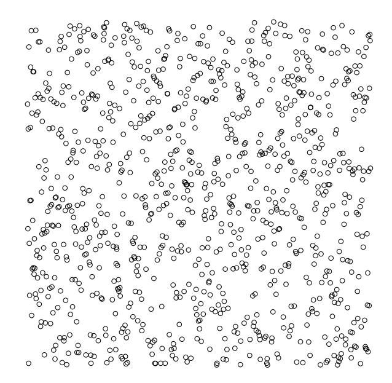
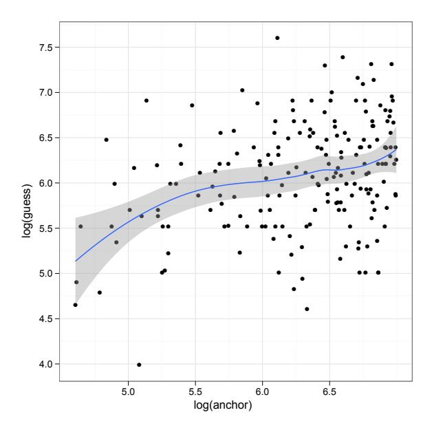
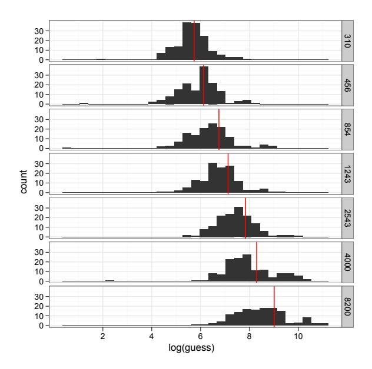
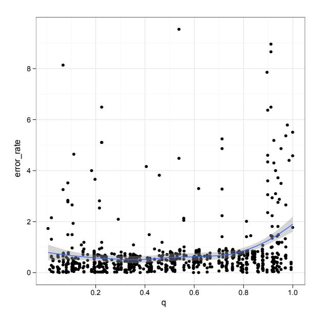

# **The Dot-Guessing Game: A "Fruit Fly" for Human Computation Research**

John J. Horton Harvard University 383 Pforzheimer Mail Center 56 Linnaean Street Cambridge, Massachusetts 02138 john.joseph.horton@gmail.com

### ABSTRACT

I propose a human computation task that has a number of properties that make it useful for empirical research. The task itself is simple: subjects are asked to guess the number of dots in an image. The task is useful because: (1) it is simple to generate examples; (2) it is a CAPTCHA; and (3) it has an objective solution that allows us to finely grade performances, yet subjects cannot simply look up the answer. To demonstrate its value, I conducted two experiments using the dot-guessing task. Across both experiments, I found that the "crowd" performed well, with the arithmetic mean guess besting most individual guesses. However, I found that subjects displayed well-known behavioral biases relevant to the design of human computation systems. In the first experiment, subjects reported whether the number of dots in an image was larger or smaller than a randomly chosen number. The randomly chosen reference number strongly anchored subjects' subsequent guesses. In the second experiment, subjects were asked to choose between an incentive payment contract that rewarded good work (and self-knowledge about relative ability) and a fixed payment contract. I found that selection of the incentive contract did not improve performance, nor did it reveal information about relative ability. However, subjects who chose the incentive contract were more likely to be male, suggesting that their choice in contracts was determined by differences in risk-aversion.

### Categories and Subject Descriptors

J.4 [Social and Behavioral Sciences]: Economics; J.m [Computer Applications]: Miscellaneous

### General Terms

Design, Economics

### Keywords

Crowdsourcing, Experimentation, Mechanical Turk

### 1. INTRODUCTION

Although new, the field of human computation (HCOMP) has already produced outsized benefits, including spam reduction, digitization of books [\[17\]](#page-5-0), improved searchability of images [\[16\]](#page-5-1), and entertainment. Even unintended consequences of this research, such as people solving reCAPTCHAs for pay, while not Pareto-improving, have positive distributional properties---workers in the developing world get cash, people in the developed world are slightly inconvenienced by spam, and books are digitized.[1](#page-0-0)

The obvious material benefits of HCOMP alone are enough to stimulate research, but the field could also be a boon to social science. In designing efficient mechanisms, researchers may gain insight into classic questions about motivation and incentives, the effects of peers and norms, and the interplay between organizational structure and outcomes.

Of course, the benefits flow in both directions: psychology, economics, and sociology have much to offer HCOMP. Designers of HCOMP systems must provide quality work, create elicitation procedures, specify the nature of inter-subject interactions (if any), motivate subjects to participate and to reveal their abilities, and decide how to aggregate inputs. Social science may offer useful insights into ways of approaching many of these design challenges.

### 1.1 Previous work

Several papers have used online labor markets such as Amazon's Mechanical Turk (MTurk) to conduct experiments [\[9,](#page-5-2) [15,](#page-5-3) [14\]](#page-5-4). Horton, Rand, and Zeckhauser discuss the social science potential of online experiments in these markets, focusing on how challenges to validity can be overcome [\[6\]](#page-5-5). There already exists a small literature on crowdsourcing from a social science perspective [\[7,](#page-5-6) [11,](#page-5-7) [5,](#page-5-8) [3\]](#page-5-9). New tools are also being developed that make experimentation easier [\[10\]](#page-5-10).

# 1.2 Overview

In this paper, I argue that one way to make social science/HCOMP collaboration more fruitful is to identify a "model task" for empirical research, analagous to the "model organisms"in the biological sciences, such as E. coli, the fruit fly, and the nematode worm. Although not considered in-

<span id="page-0-0"></span><sup>1</sup> "Spammers Pay Others to Answer Security Tests," The New York Times, April 25, 2010, [http://www.nytimes.com/2010/04/26/technology/26captcha.html.](http://www.nytimes.com/2010/04/26/technology/26captcha.html)

trinsically interesting, these organisms possess certain properties that make them especially attractive for research purposes. I propose a dot-guessing game, where subjects guess the number of dots in a computer-generated image, as a potential model task. In order to demonstrate its utility and generate new HCOMP-relevant research, I used this task in two experiments conducted on MTurk. The experiments were designed to explore practical HCOMP/crowdsourcing issues: the side-effects of certain forms of elicitation, the potential of using type-revealing contract choices to infer ability and/or (justified) confidence, and the relationships among incentives, effort, and quality.

### 1.3 Main Experimental Findings

In general, subjects did remarkably well at the task, confirming the "wisdom of crowds." After excluding some egregiously poor guesses, the mean guess was consistently better than most individual guesses. Weighting subjects based on their performance on an initial screening task improved prediction accuracy substantially, though all of the gain came from excluding very poor performers.

In the first experiment, I found that subjects were highly susceptible to "anchoring effects." Before offering a guess, subjects were asked if the true number of dots was above or below some randomly chosen number. This above/below number had a strong effect on subsequent guesses. In the second experiment, I found that offering "high-powered" incentive contracts tying payment to performance were largely ineffective. Uptake of the contract did not reveal which subjects were actually good at the task. Uptake was, however, correlated with gender. Both the anchoring result and the gender/risk preference result have been noted in behavioral economics experiments.

### 2. A MODEL TASK?

There is great diversity among HCOMP tasks, evidenced by the differences among tasks such as image labeling, transcription, translation, and evaluation/filtering. If we consider HCOMP more broadly, the list grows to include such tasks as offering subjective probabilities (e.g., through prediction markets or scoring rules) and generating new labels, slogans, designs, etc.

It would be convenient to have a single task in experimental studies that could generate results generalizable to other domains. Such a task could improve our ability to compound knowledge and lead to more replications, thereby increasing our confidence in findings. It seems unlikely that a universally appropriate task exists. However, there are certain commonalities among HCOMP tasks and, at least for basic research, certain tasks might partially fill the model organism role.

What are some desirable characteristics for such a task? It should be culturally neutral and easy to explain, even to subjects with poor literacy skills. The quality of worker output should be objective and easy to measure, yet quality should be naturally heterogeneous. "Natural" variation in quality is necessary, not only in order to make it easy to identify treatment effects from different manipulations, but also because one of the key challenges in mechanism design is reliably identifying and overweighting top performers and reducing the influence of poor performers.

Ideally, quality should be a nearly-continuous variable, permitting fine-grained distinctions which make competitive play possible at both the dyad and group levels. Continuous measures minimize the chance of ties, making it easier to offer precise relative-performance contracts or to display subjects' relative positions on a "leader board." Continuous quality measures also simplify analysis by permitting the use of linear models instead of the more complex models needed to analyze dichotomous outcomes. In order to investigate learning, the task should allow subjects to improve with effort or training. There should also be positive relationships between incentives and effort and between effort and quality.

Because so many HCOMP tasks deal with aggregating bits of information, the model task should have a "wisdom of crowds" potential. At the same time, there might also be cases where groupthink, herding, or the "madness of crowds" could prevail. Ideally, subjects should be able to share information and to respond to information about the task provided by others. To measure group-level performance, work outputs should be easy to aggregate so that different aggregation approaches can be tested.

Finally, logistically, we want to be able to generate new, unique tasks with ease. Any task should---like a CAPTCHA be a hard AI problem, especially if we try to use highpowered incentives that might encourage cheating via algorithms.

### 2.1 Dot-guessing game

In one of the first "wisdom of crowds" demonstrations, Francis Galton analyzed the results of a contest where fairgoers guessed the weight of a butchered ox. While most individual guesses were far off the mark, the mean guess was remarkably accurate. It is easy to generate a 21st-century version of this game for play over the Internet: subjects are asked to guess the number of dots in a computer-generated image, an example of which is shown in Figure [1](#page-2-0) (along with the four lines of R code needed to generate the image). Creating new and unique tasks in any computer language is only marginally more challenging than the "hello world" program.

Aside from ease of creation, the dot-guessing game has a number of desirable properties as a research tool. It is very simple to explain. It has an unambiguous quality metric how far off a guess is from the correct answer---and yet answers cannot simply be looked up online or solved (easily) with a computer. It is in some ways similar to the "pseudosubjective" questions psychologists have used to measure over-confidence, such as asking subjects to estimate the length of the Nile river or the gestation period (in days) of an Asian elephant [\[2\]](#page-5-11).

Obviously the dot-guessing game also has limitations. It is not good for generative tasks (e.g., image labeling). Nor is it ideal for studying coordination, where tasks like the graphcoloring problem may be more appropriate [\[8\]](#page-5-12). However, for a wide range of human computation scenarios that require judgment by workers and the screening and aggregation of inputs, the dot-guessing game offers many advantages.

```
> par(mar = c(0, 0, 0, 0))
> n = 500
> X = c(runif(n, 0, 1), runif(n, 0, 1))
> plot(X, axes = F, xlab = "", ylab = "")
```



<span id="page-2-0"></span>Figure 1: Example dot-guessing game with generating R code.

#### 3. EXPERIMENT A

In the first experiment, 200 subjects were recruited to complete a single HIT. They each inspected a single image containing 500 dots and offered a guess. Before proffering a guess, each subject first answered whether they thought the number of dots was greater than or less than a number X randomly drawn from a uniform distribution,  $X \sim U[100, 1200]$ .

#### 3.1 Results

Overall, subjects performed quite well, with the mean besting most individual guesses once very bad outliers were removed. Table 1 shows the performance results for the "Anchor

<span id="page-2-1"></span>Table 1: Dot-guessing performance

| Dots          | Mean     | Geo. Mean | Med. | $^{\mathrm{SD}}$ | N   | Quant. |
|---------------|----------|-----------|------|------------------|-----|--------|
| Anchor Exp    | periment |           |      |                  |     |        |
| 500           | 517      | 435       | 450  | 315              | 195 | 0.93   |
| Incentive $E$ | xperimer | at        |      |                  |     |        |
| 310 (1)       | 375      | 285       | 292  | 349              | 158 | 0.69   |
| 456 (2)       | 537      | 373       | 400  | 554              | 148 | 0.74   |
| 854 (3)       | 986      | 579       | 606  | 1454             | 138 | 0.83   |
| 1243  (4)     | 1232     | 866       | 850  | 1443             | 143 | 0.99   |
| 2543 (5)      | 2362     | 1684      | 1700 | 2580             | 147 | 0.94   |
| 4000 (6)      | 4888     | 2855      | 2562 | 5970             | 144 | 0.92   |
| 8200 (7)      | 8559     | 4748      | 4644 | 12267            | 134 | 0.96   |

*Notes:* Data excludes subjects with error rates greater 10. "Quant." reports the location of the error associated with the mean guess in the distribution of errors associated with all guesses.



<span id="page-2-2"></span>Figure 2: Log guesses versus log anchors. Subjects' guesses for a 500-dot image are plotted against their anchors.

Experiment" (as well as for the follow-on experiment) after removing subjects with an error *rate* of 10 or greater. The experiment highlights the dangers of free-response elicitation: one subject estimated that the photograph contained 15823 dots---an over-estimate by a factor of over 31.

#### 3.1.1 Anchoring effects

Despite the good aggregate performance, subjects' guesses about the 500-dot image were strongly affected by asking whether the number of dots was above or below the randomly chosen anchors: a 10-point increase in the anchor increases guesses by approximately 3 points. Regressing guesses on the anchors gives

$$y_i = \underbrace{0.283}_{0.08} \cdot X_i + \underbrace{341.841}_{52.38}$$

with  $R^2 = 0.07$  and N = 194. Standard errors are shown underneath the coefficient estimates. Figure 2 illustrates the guess-anchor relationship through a scatter plot of the logged guesses versus the logged anchors and a local kernel regression line.

### 4. EXPERIMENT B

The second experiment was designed to test whether incentive contracts reveal information about subject confidence and/or motivate better performance. Subjects were simultaneously asked to guess the number of dots in an image and to state their preference between two incentive contracts: (1) \$5.00 if the subject's answer was in the top half of all guesses, \$0 otherwise; or (2) \$2.50 for certain. The response was coded as  $risk_{ij} = 1$  if the subject chose the incentive contract,  $risk_{ij} = 0$  if the subject chose the fixed contract. Similarly, if a subject i was in the top half of the distribution for image j, then  $top_{ij} = 1$ . Subjects were allowed to



<span id="page-3-0"></span>Figure 3: Distributions of log guesses with correct answers indicated by vertical bars.

view up to seven images, each of which contained a different number of dots. Having multiple responses per subject makes a multilevel model appropriate for analysis [\[4\]](#page-5-13), and all the regressions include individual-specific random effects.

Subjects were not truly randomly assigned to HITs, but rather were randomly assigned a HIT from the pool of uncompleted HITs. When a worker "returned" a task (i.e., decided not to complete it), it was returned to the pool. Over time, the portion of images with high numbers of dots in the pool increased, as workers were more likely to return those images. The reasons workers found those images more burdensome are unclear. The most likely explanation is that the images simply took longer to download, due to larger file sizes: in a short follow-on experiment using images of equal file size containing different numbers of dots, differential attrition disappeared.

To minimize the burden of answering survey questions, subjects were randomly assigned to be asked one of the following demographic questions or no question at all: (1) age, (2) gender, or (3) both age and gender.

### 4.1 Results

Figure [3](#page-3-0) shows the histograms of log guesses for each of the seven images. The logs of the correct answers are shown by vertical red lines. In general, guesses appear to be log normally distributed. Among the images with relatively fewer dots, the distributions appear to be symmetric around the correct answers. The symmetry breaks down among the images with larger numbers of dots, and there is evidence of systematic under-guessing combined with a few very large positive outliers.

#### *4.1.1 Contract Choice*

Few subjects selected to take the incentive contract, with mean uptake only 22.43%. Regressing contract choice on an indicator for being in the top of the distribution, we have

$$risk_{ij} = \underbrace{-0.00}_{0.02} \cdot top_{ij} + \underbrace{0.25}_{0.03} + \dots$$

with R <sup>2</sup> = 0.74 and N = 1012. As with all the regressions examining the second experiment, this regression includes picture fixed effects and individual random effects. We can see that the choice of contract does not appear to reveal anything meaningful about the quality of the subjects' responses. Unsurprisingly, the error rate is also unrelated to contract choice. Regressing Eij on the incentive contract indicator and dummy variables for each of the seven images (coefficeints are omitted below), there is no apparent relationship

$$E_{ij} = \underbrace{0.03}_{0.09} \cdot risk_{ij} + \dots$$

with R <sup>2</sup> = 0.65 and N = 1012.

As we can see from the regression line, workers who chose the incentive contract performed slightly worse, but the effect was not significant. However, those workers did spend more time on the task, though the effect was not significant at conventional levels:

$$\log time_{ij} = \underbrace{0.10}_{0.06} \cdot risk_{ij} + \dots$$

with image-specific fixed effects and individual level random effects, giving R <sup>2</sup> = 0.98 and N = 1012. Note that the high R 2 in this regression results from the inclusion of the fixed effects of the image. Because the task itself took so little time, most of the variation in times is likely the result of differences in download time. Although in this experiment there was no relationship between time spent and work quality, this is certainly not a general result. Adding an incentive contract could be beneficial, even if the choice of contract is not type-revealing.

### 4.2 Gender and contract choice

Regressing contract choice on gender, and including imagespecific fixed-effects and individual-specific random effects, we have

$$risk_{ij} = \underbrace{0.11}_{0.05} \cdot male_{ij} + \dots$$

with R <sup>2</sup> = 0.75 and N = 949. Although both male and female subjects preferred the fixed contract, females had a stronger preference for the risk-free contract. This is consistent with experimental evidence that females are more risk-averse when playing abstract games.[2](#page-3-1) This finding of gender difference is not in itself surprising, but it does suggest that using incentive contract uptake to sort individuals is problematic and could lead to inefficient, gender-based discrimination.

In fact, risk-seeking male subjects actually performed slightly

<span id="page-3-1"></span><sup>2</sup>However, others have argued that this gender difference disappears when decisions are contextualized as real business decisions about things like investments and insurance [\[13\]](#page-5-14).



<span id="page-4-0"></span>Figure 4: Relative performances (percentiles) on initial tasks versus error rates on subsequent tasks.

worse than females, although the effect is not significant

$$E_{ij} = \underbrace{0.09}_{0.13} \cdot male_{ij} + \dots$$

with image fixed effects and individual random effects, giving  $R^2=0.66$  and N=949.

### 5. IMPROVING ESTIMATES

To improve accuracy in applications, one would presumably try to give more weight to the output of better workers. To demonstrate how this can be done with the dot-guessing task, I weighted subjects based on relative performance on the first task completed. For each subject who completed more than one image, I computed their error on the first image and where the performance placed them in the distribution of all performances for that image.

Figure 4 is a scatter plot of subjects' relative performances on their respective initial tasks versus error rates for subsequent tasks. A local kernel density estimate shows that subsequent performance is fairly uniform up to about the 90th percentile, perhaps with some evidence of mean reversion for very low quantiles, and that after the 90th percentile performance is much worse, with many subjects achieving error rates of 200% or more.

To improve performance, I used a very simple weighting method with just two parameters. I split the distribution of errors at s, and then gave all subjects who performed better than s a weight of 1, and all who performed worse than s a weight of h, with h < 1. Using a grid search, I found that the mean error is minimized when s = .95 and h = 0. Because the quantiles (and, hence, the parameters) were determined using a subject's first image, using this weighting scheme for all observations would lead to a mechanical reduction in the

<span id="page-4-1"></span>Table 2: Effects of ex post weighting

| Image | Dots | Unadj.       | Adj.             | Chg. |
|-------|------|--------------|------------------|------|
| 1     | 310  | 344 (0.11)   | 318 (0.027)      | +    |
| 2     | 456  | 529(0.16)    | 485 (0.063)      | +    |
| 3     | 854  | 941 (0.102)  | 855 (0.002)      | +    |
| 4     | 1243 | 1267 (0.019) | 1252 (0.007)     | +    |
| 5     | 2543 | 2366 (0.07)  | 2345 (0.078)     | -    |
| 6     | 4000 | 4839 (0.21)  | 4648 (0.162)     | +    |
| 7     | 8200 | 9683 (0.181) | $9473 \ (0.155)$ | +    |

Notes: Estimates using optimal weighting function (s = .95, h = 0). The error rate, |est. - truth|/truth, is in parentheses. Estimates do not include the subjects' first tasks completed.

error rate. Instead, I computed the mean guess (weighted and unweighted) without using any first responses. Table 2 shows that, in general, adjusting the estimate leads to improvement in accuracy. In six out of seven cases, the mean error of the adjusted estimate was lower than the unadjusted estimate.

#### 6. CONCLUSION

The results generally confirm the "wisdom of crowds" hypothesis. By excluding the worst performers, the mean guesses were quite accurate, though performance worsened as the number of dots in the image increased.

In terms of the treatment effects, subjects were prone to the anchoring bias: when subjects were asked whether the number of dots in an image was above or below some randomly chosen number, the number strongly affected subjects' guesses.

I found that subjects to do not reveal their type (i.e., relative aptitude for the task) through their preference in contract type. Males were more likely to choose an incentive contract, but they performed no better than females. There is some evidence that subjects who chose the incentive contract spent more time on the tasks, though it is unclear which way causality ran. Ex post processing of the data improved prediction accuracy: removing the worst 5% of subjects led to improvements in accuracy, reducing the error in six of the seven cases (and essentially equalizing the results of the seventh case).

#### **6.1** Implications

The results suggest that mechanism designers should consider that: (a) choice of contract type may not be informative, and (b) differences in risk appetite (which may be systematic and/or have a gender component) may lead to mechanisms that inefficiently overweight the over-confident. Because I found a positive correlation between time spent and preference for an incentive contract, it may be the case that incentive contracts improve quality, though contract choice was endogenous, as was the time spent on the task.

The anchoring results suggest that mechanism designers must be cautious in querying subjects, even in a hypothetical manner. It seems possible that subjects will accept those questions as informative and adjust their beliefs rather than treat them as irrelevant (in the sense of not providing new information).

### 6.2 Case for Empiricism

As more aspects of social life moves online, both the size of collected observational data and the potential to conduct experiments will continue to grow. The transition to a bench science, where hypotheses can be quickly tested through experimentation, is bound to have positive effects.

The case for empiricism is particularly strong in designing mechanisms, as theory offers little guidance about cognitive demands on the mechanism, how contextual factors are likely to influence subjects, how boundedly rational workers actually play, etc. To make practically useful mechanisms, it is important to understand how they hold up when the players are real people, prone to the biases and subject to the limitations of real people [\[12\]](#page-5-15).

### 7. ACKNOWLEDGMENTS

Thanks to the the Christakis Lab at Harvard Medical School and the NSF-IGERT Multidisciplinary Program in Inequality & Social Policy for generous financial support (Grant No. 0333403). Thanks to Robin Yerkes Horton, Brendan O'Connor, Carolyn Yerkes, and Richard Zeckhauser for very helpful comments. All plots were made using ggplot2 [\[18\]](#page-5-16) and all multilevel models were fit using lme4[\[1\]](#page-5-17).

## 8. REFERENCES

- <span id="page-5-17"></span>[1] D. Bates and D. Sarkar. lme4: Linear mixed-effects models using S4 classes. URL http://CRAN. R-project. org/package= lme4, R package version 0.999375-28, 2008.
- <span id="page-5-11"></span>[2] B. Biais, D. Hilton, K. Mazurier, and S. Pouget. Judgemental overconfidence, self-monitoring, and trading performance in an experimental financial market. Review of Economic Studies, pages 287--312, 2005.
- <span id="page-5-9"></span>[3] D. L. Chen and J. J. Horton. The wages of paycuts: Evidence from a field experiment. Working Paper, 2009.
- <span id="page-5-13"></span>[4] A. Gelman and J. Hill. Data analysis using regression and multilevel/hierarchical models. Cambridge University Press Cambridge, 2007.
- <span id="page-5-8"></span>[5] J. J. Horton and L. B. Chilton. The labor economics of paid crowdsourcing. Proceedings of the 11th ACM Conference on Electronic Commerce 2010 (forthcoming), 2010.
- <span id="page-5-5"></span>[6] J. J. Horton, D. Rand, and R. J. Zeckhauser. The online laboratory: Conducting experiments in a real labor market. SSRN eLibrary, 2010.
- <span id="page-5-6"></span>[7] B. A. Huberman, D. Romero, and F. Wu. Crowdsourcing, attention and productivity. Journal of Information Science (in press), 2009.
- <span id="page-5-12"></span>[8] M. Kearns, S. Suri, and N. Montfort. An experimental study of the coloring problem on human subject networks. Science, 313(5788):824, 2006.
- <span id="page-5-2"></span>[9] A. Kittur, E. H. Chi, and B. Suh. Crowdsourcing user studies with mechanical turk. Proceedings of Computer Human Interaction (CHI-2008), 2008.
- <span id="page-5-10"></span>[10] G. Little, L. B. Chilton, R. Miller, and M. Goldman. Turkit: Tools for iterative tasks on mechanical turk. Working Paper, MIT, 2009.

- <span id="page-5-7"></span>[11] W. Mason and D. J. Watts. Financial incentives and the 'performance of crowds'. In Proc. ACM SIGKDD Workshop on Human Computation (HCOMP), 2009.
- <span id="page-5-15"></span>[12] D. McFadden. The human side of mechanism design: A tribute to Leo Hurwicz and Jean-Jacque Laffont. Review of Economic Design, 13(1):77--100, 2009.
- <span id="page-5-14"></span>[13] R. Schubert, M. Brown, M. Gysler, and H. W. Brachinger. Financial decision-making: Are women really more risk-averse? The American Economic Review, 89(2):381--385, 1999.
- <span id="page-5-4"></span>[14] V. S. Sheng, F. Provost, and P. G. Ipeirotis. Get another label?: Improving data quality and data mining using multiple, noisy labelers. Knowledge Discovery and Data Minding 2008 (KDD-2008), 2008.
- <span id="page-5-3"></span>[15] R. Snow, B. O'Connor, D. Jurafsky, and A. Y. Ng. Cheap and fast---but is it good?: Evaluating non-expert annotations for natural language tasks. Proceedings of the Conference on Empirical Methods in Natural Language Processing (EMNLP 2008), 2008.
- <span id="page-5-1"></span>[16] L. Von Ahn and L. Dabbish. Labeling images with a computer game. In Proceedings of the SIGCHI conference on Human factors in computing systems, pages 319--326. ACM, 2004.
- <span id="page-5-0"></span>[17] L. Von Ahn, B. Maurer, C. McMillen, D. Abraham, and M. Blum. reCAPTCHA: Human-based character recognition via web security measures. Science, 321(5895):1465, 2008.
- <span id="page-5-16"></span>[18] H. Wickham. ggplot2: An implementation of the grammar of graphics. R package version 0.7, URL: http://CRAN.R-project.org/package=ggplot2, 2008.